# IPv6 安全验证系统 — 技术方案

> 文档版本：v1.0
> 制定日期：2026 年 5 月

---

## 目录

**第一章 方案概述**
- [1.1 平台简介](#11-平台简介)
- [1.2 方案核心价值](#12-方案核心价值)
- [1.3 功能模块全景](#13-功能模块全景)
- [1.4 技术路线（技术选型）](#14-技术路线技术选型)
- [1.5 合规与适配](#15-合规与适配)
- [1.6 工作范围与项目目标](#16-工作范围与项目目标)

**第二章 系统架构**
- [2.1 设计原则](#21-设计原则)
- [2.2 逻辑架构](#22-逻辑架构)
- [2.3 部署架构](#23-部署架构)
- [2.4 关键数据流](#24-关键数据流)
- [2.5 组件依赖](#25-组件依赖)
- [2.6 数据模型版本管理](#26-数据模型版本管理)

**第三章 硬件与部署**
- [3.1 硬件要求](#31-硬件要求)
- [3.2 网络拓扑](#32-网络拓扑)
- [3.3 部署形态](#33-部署形态)
- [3.4 安装与初始化](#34-安装与初始化)

**第四章 数据架构**
- [4.1 数据存储分层](#41-数据存储分层)
- [4.2 关系数据模型](#42-关系数据模型)
- [4.3 搜索与分析数据](#43-搜索与分析数据)
- [4.4 对象存储数据](#44-对象存储数据)
- [4.5 数据保留策略](#45-数据保留策略)
- [4.6 数据备份能力](#46-数据备份能力)
- [4.7 数据安全](#47-数据安全)

**第五章 可观测性**
- [5.1 可观测性体系](#51-可观测性体系)
- [5.2 日志能力](#52-日志能力)
- [5.3 健康检查](#53-健康检查)
- [5.4 指标暴露](#54-指标暴露)
- [5.5 外部监控平台对接](#55-外部监控平台对接)

**第六章 核心业务功能**
- [6.1 流量安全验证](#61-流量安全验证)
- [6.2 应用与服务器安全验证](#62-应用与服务器安全验证)
- [6.3 自定义验证](#63-自定义验证)
- [6.4 攻击编排](#64-攻击编排)
- [6.5 沙箱管理](#65-沙箱管理)

**第七章 系统级功能**
- [7.1 用户与权限管理](#71-用户与权限管理)
- [7.2 资产管理](#72-资产管理)
- [7.3 用例库管理](#73-用例库管理)
- [7.4 报告与仪表板](#74-报告与仪表板)
- [7.5 审计日志](#75-审计日志)
- [7.6 任务历史与验证记录](#76-任务历史与验证记录)

**第八章 交付标准（验收指标）**
- [8.1 交付物清单](#81-交付物清单)
- [8.2 功能验收指标](#82-功能验收指标)
- [8.3 非功能验收指标](#83-非功能验收指标)
- [8.4 验收流程](#84-验收流程)

**第九章 实施进度（时间点）**
- [9.1 总体安排](#91-总体安排)
- [9.2 阶段里程碑](#92-阶段里程碑)
- [9.3 关键交付时间点](#93-关键交付时间点)
- [9.4 风险与依赖](#94-风险与依赖)

---

# 第一章 方案概述

## 1.1 平台简介

本系统是一套面向 IPv6 网络环境的企业级安全验证平台。平台通过持续、自动化、可量化的攻击模拟手段，对客户既有安全防御体系进行真实有效性验证，让"防御能力可视、可测、可证"成为日常运营的一部分。

不同于传统的渗透测试或漏洞扫描，平台聚焦于"防御是否真的拦得住"与"告警是否真的看得见"两个核心问题，通过持续验证的方式，帮助客户回答以下关键问题：

- 在网络边界部署的检测设备，对新型威胁的覆盖度如何？
- 主机上的安全 Agent，能否及时发现典型攻击行为？
- SOC 告警规则，在真实攻击发生时是否能触发？
- 当一次复合攻击穿越多道防线时，整体防御体系处于什么状态？

本文档面向客户技术决策者、安全运营团队、招标评审专家与基础设施规划工程师，旨在系统性阐述平台的整体技术方案、功能能力与部署要求。

## 1.2 方案核心价值

| 维度 | 价值 |
| --- | --- |
| **完整覆盖** | 完整满足业务需求中规定的全部功能要求，并在多个维度提供企业级配套能力 |
| **可视化呈现** | 攻击编排、执行过程、ATT&CK 战术覆盖等关键能力均以可视化方式呈现，无需技术背景即可理解 |
| **闭环验证** | 从用例编排、攻击执行、防御检测到结果评估，形成完整闭环 |
| **合规就绪** | 内置审计日志、细粒度权限、操作可追溯，满足等保 2.0 三级与关键基础设施安全保护要求 |
| **国产化适配** | 原生支持国产化 CPU 与国产化操作系统，IPv6 双栈贯穿全链路 |

## 1.3 功能模块全景

### 1.3.1 核心业务功能

平台覆盖安全验证业务的五大核心场景：

| 业务场景 | 平台能力 | 详见 |
| --- | --- | --- |
| 流量安全验证 | 网络边界资产覆盖度验证、流量安全设备稳定性验证、流量侧攻击防护效用验证、多端口四元组用例 | [§ 6.1](#61-流量安全验证) |
| 应用与服务器安全验证 | 主机侧多类攻击防护效用验证 | [§ 6.2](#62-应用与服务器安全验证) |
| 自定义验证 | 自定义场景与执行顺序、批量导入用例、多种类型自定义用例、用例筛选生成场景、动态用例集实时联动 | [§ 6.3](#63-自定义验证) |
| 攻击编排 | 可视化链路编排、节点配置、执行逻辑、验证参数、执行模式、SOC 关联告警、运行画布、时间轴、三态验证结果 | [§ 6.4](#64-攻击编排) |
| 沙箱管理 | 恶意样本沙箱执行、沙箱平台管理、网络访问控制策略、用例执行后自动还原 | [§ 6.5](#65-沙箱管理) |

### 1.3.2 系统级功能

平台还原生提供下列企业级系统功能，确保整套方案在日常运营中可独立、完整地承担安全验证任务：

| 模块 | 平台能力概述 | 详见 |
| --- | --- | --- |
| **用户与权限管理** | 用户、角色、团队多层模型，支持基于资源的细粒度授权 | [§ 7.1](#71-用户与权限管理) |
| **资产管理** | 主机资产、通用资产、资产组（静态成员与动态成员双轨制） | [§ 7.2](#72-资产管理) |
| **用例库管理** | 用例契约、攻击载荷、ATT&CK 攻击模式库、杀伤链阶段、标签与文档附件 | [§ 7.3](#73-用例库管理) |
| **报告与仪表板** | 自定义仪表板、可视化组件、攻击路径分析、数据导出 | [§ 7.4](#74-报告与仪表板) |
| **审计日志** | 业务实体变更审计、自动写入机制，满足等保合规要求 | [§ 7.5](#75-审计日志) |
| **任务历史与验证记录** | 任务列表、任务详情、节点明细、关联告警 | [§ 7.6](#76-任务历史与验证记录) |

## 1.4 技术路线（技术选型）

平台的技术路线以"工业级成熟组件 + 分层解耦架构 + 容器化交付"为核心，所有关键选型均围绕"稳定性、生态成熟度、国产化兼容性、可演进性"四个维度展开。

### 1.4.1 技术栈

平台采用经过工业级验证的成熟技术栈，兼顾性能、稳定性与生态丰富度：

| 层次 | 技术 |
| --- | --- |
| 后端框架 | Spring Boot 3.3.7 / Java 21 |
| 前端框架 | React 19 / TypeScript / Vite |
| 关系数据库 | PostgreSQL 17 |
| 搜索引擎 | Elasticsearch 8 |
| 对象存储 | MinIO |
| 消息队列 | RabbitMQ |
| 任务调度 | Quartz |
| 可视化画布 | ReactFlow |

### 1.4.2 关键架构特性

- **分层解耦**：用户接入层、接入网关层、业务领域层、数据层、外部集成层五层清晰分离，各层职责单一
- **能力接口化**：流量回放设备、主机 Agent、SOC 告警系统、沙箱后端等外部能力均通过标准接口接入，便于按客户既有环境选型
- **演进式数据模型**：基于版本化迁移机制，所有数据结构变更顺序应用、向后兼容
- **容器化交付**：全部组件以容器镜像形式交付，部署一致、运行隔离

### 1.4.3 技术选型说明

每一项技术选择均有明确的取舍依据，确保选型与平台目标对齐：

| 选型维度 | 选定方案 | 选型理由 |
| --- | --- | --- |
| 后端运行时 | Java 21 (LTS) + Spring Boot 3.3.7 | LTS 长期维护版本；Spring 生态在企业级安全产品中占主导地位；与国产化运行环境（毕昇 JDK、龙井 JDK 等）兼容良好 |
| 前端技术 | React 19 + TypeScript + Vite | React 在企业控制台领域生态最广；TypeScript 强类型保障；Vite 构建速度快、HMR 友好 |
| 关系数据库 | PostgreSQL 17 | 强一致性、丰富索引、JSON / 数组等扩展类型支持；可平滑切换至国产化派生版（如人大金仓、瀚高） |
| 搜索引擎 | Elasticsearch 8 | 全文检索、聚合分析、时间序列查询能力齐备；可平滑切换至 OpenSearch |
| 对象存储 | MinIO | 兼容 S3 协议，私有化部署友好；样本、pcap、报告等非结构化数据的标准承载 |
| 消息队列 | RabbitMQ | 异步任务调度、节点执行结果回写场景成熟稳定 |
| 任务调度 | Quartz | 与 Spring Boot 集成度高；支持持久化调度、集群部署、复杂时间表达 |
| 可视化画布 | ReactFlow | 攻击编排链路画布的事实标准选择，支持自定义节点、边、布局算法 |
| 外部能力对接 | 接口化适配层 | 流量回放设备、主机 Agent、SOC、沙箱等异构组件通过标准接口接入，避免硬绑定特定厂商产品 |
| 部署形态 | 容器镜像 | 部署一致性、运行隔离、版本回滚便捷，与客户既有容器编排平台无缝对接 |

### 1.4.4 演进与兼容策略

- **数据库变更**：所有结构变更采用版本化迁移脚本，顺序应用、向后兼容
- **接口演进**：业务接口采用增量演进方式，旧版本接口在过渡期内保留
- **依赖升级**：定期同步上游组件安全补丁；重大版本升级前在测试环境完成兼容性验证

## 1.5 合规与适配

平台从设计之初便针对中国市场企业级合规要求作了系统性适配：

| 维度 | 适配说明 |
| --- | --- |
| **硬件适配** | 完整支持业务需求的 2U 机架式国产化 CPU 设备形态，硬件规格规划详见 [§ 3.1](#31-硬件要求) |
| **等保合规** | 审计日志、RBAC 权限、传输加密、数据加密、操作可追溯等关键控制点完整覆盖 |
| **IPv6 网络** | 原生支持 IPv6 网络栈，前端 UI、后端接入入口、外部集成全链路 IPv6 双栈 |
| **国产化生态** | 适配主流国产 CPU 架构与国产化 Linux 发行版 |

## 1.6 工作范围与项目目标

### 1.6.1 项目目标

本项目以构建一套面向 IPv6 网络环境的企业级安全验证平台为总体目标，使客户具备"持续、自动、可量化"的安全防御真实有效性验证能力：

- **防御可视**：让网络边界、主机端点、SOC 告警三个层面的防御能力变成可观察的运营指标
- **防御可测**：通过标准化的攻击用例与多种验证模式，对防御能力进行端到端的真实测量
- **防御可证**：以验证记录、报告、仪表板形态沉淀证据链，支撑等保合规与内部安全考核

### 1.6.2 工作范围

本次项目工作范围覆盖如下内容：

| 类别 | 范围说明 |
| --- | --- |
| **平台建设** | 完成本方案第二章至第七章定义的全部模块开发与集成，含 IPv6 双栈适配 |
| **环境部署** | 标准 2U 机架式硬件采购选型支持、平台容器化部署、依赖组件部署、初始化配置 |
| **外部对接** | 与客户既有 SOC / SIEM、流量回放设备、主机 HIDS、沙箱平台等外部组件的标准接口对接 |
| **数据初始化** | 用例库、攻击模式库（ATT&CK）、资产清单导入模板、默认仪表板模板等初始数据装载 |
| **培训与交付** | 平台管理员培训、安全运营人员操作培训、运维手册与用例库维护手册交付 |
| **质保期支持** | 自正式验收之日起 3 个月内的功能缺陷修复与重大问题响应 |

### 1.6.3 范围外事项

下列内容不在本项目工作范围内，如有需求需另行约定：

- 客户既有 SOC / SIEM 系统自身的改造与升级
- 客户既有流量回放设备、HIDS Agent、沙箱平台的采购与运维
- 客户内部网络改造（如尚不具备 IPv6 双栈条件的核心链路改造）
- 平台之外的渗透测试、漏洞扫描、应急响应服务
- 攻击用例之外的定制化威胁情报源订阅

### 1.6.4 干系人与职责

| 角色 | 职责 |
| --- | --- |
| **客户项目负责人** | 协调内部资源、确认阶段交付、签署验收单 |
| **客户安全运营团队** | 参与 UAT 测试、提供攻击用例需求与 SOC 关联规则、接收培训 |
| **客户运维团队** | 提供部署环境、网络接入、运维监控对接支持 |
| **实施方项目经理** | 整体进度管理、风险跟踪、对客沟通 |
| **实施方技术负责人** | 架构落地、技术决策、关键问题攻关 |
| **实施方实施工程师** | 部署、配置、集成、UAT 支持 |

### 1.6.5 关键假设与前提

项目按计划推进依赖以下前提，任一前提未满足时需通过变更流程处理：

- 客户提供符合 [§ 3.1](#31-硬件要求) 规格的硬件设备并完成上架通电
- 客户提供管理网络与数据平面 IPv6 双栈可达性
- 客户既有 SOC / SIEM 系统支持本方案约定的标准化对接方式
- 客户提供项目期内必要的访问授权与配合人员

---

# 第二章 系统架构

本章阐述平台的整体技术架构、部署形态、关键数据流与组件依赖关系，帮助读者建立对平台技术全貌的认知。

## 2.1 设计原则

平台架构在设计阶段确立了以下五项核心原则，贯穿全部模块与组件：

| 原则 | 含义 |
| --- | --- |
| **分层解耦** | 用户接入、API 服务、业务领域、数据存储、外部集成五层清晰分离，各层职责单一、边界明确 |
| **能力接口化** | 流量回放、主机 Agent、SOC 告警、沙箱后端等外部能力通过标准接口接入，便于客户按既有安全设备选型 |
| **演进式数据模型** | 基于版本化数据库迁移机制，所有数据结构变更顺序应用、向后兼容、可追溯 |
| **容器化交付** | 全部组件以容器镜像形式交付，部署一致、运行隔离 |
| **可观测性内置** | 日志、指标、健康检查协同工作，关键业务事件可观测、可告警、可分析 |

## 2.2 逻辑架构

平台从逻辑上分为五个层次。下图展示了各层组件及其交互关系：



### 2.2.1 各层职责

**用户接入层** —— 平台对外的入口

- **Web 控制台**：基于现代前端框架构建的单页应用，覆盖全部功能的可视化操作。安全运营人员通过浏览器即可完成日常工作
- **外部系统接入**：面向第三方系统的标准化平台接入能力，便于自动化集成

**接入网关层** —— 请求接入与权限网关

- 按业务领域组织能力，结构清晰
- 提供统一的认证与鉴权能力：先确认"你是谁"，再确认"你能做什么"
- 权限策略集中声明，便于审查与维护

**业务领域层** —— 平台核心能力

| 引擎 | 职责 |
| --- | --- |
| 攻击编排引擎 | 链路定义、节点关系、执行模式策略 |
| 链路任务调度器 | 任务调度，支持节点延迟、重复、条件分支 |
| 期望评估引擎 | 节点级与链路级期望双层评估，结果计算 |
| SOC 关联分析 | 基于客户既有 SIEM 系统进行告警关联查询 |
| 用例匹配引擎 | 动态 filter 匹配，支持实时联动 |
| 沙箱管理服务 | 沙箱实例 CRUD、网络策略配置、执行后环境还原 |

**数据层** —— 多种存储介质各司其职

| 存储 | 承载内容 |
| --- | --- |
| PostgreSQL | 核心关系数据（用户、资产、用例、链路、运行记录等） |
| Elasticsearch | 全文搜索、ATT&CK 矩阵聚合分析、历史结果时间序列 |
| MinIO | 样本文件、pcap 流量包、报告附件等非结构化对象 |
| RabbitMQ | 异步任务消息、任务完成事件通知 |

**外部集成层** —— 与客户既有安全设备的桥梁

| 外部组件 | 在验证流程中的角色 |
| --- | --- |
| 流量回放设备 | 执行流量侧攻击用例 |
| 主机 HIDS Agent | 在被验证主机上执行主机侧攻击用例 |
| SIEM 系统 | 提供告警数据，用于验证告警关联是否生效 |
| 沙箱执行环境 | 执行恶意样本用例的隔离环境 |
| 攻击控制框架 | 执行复杂攻击行为的远程控制框架 |

## 2.3 部署架构

### 2.3.1 部署拓扑

平台采用一体化容器化部署，全部核心组件运行在同一台 2U 机架式服务器上，外部组件通过 IPv6 双栈网络接入：



### 2.3.2 部署形态

| 特性 | 说明 |
| --- | --- |
| 部署方式 | 容器化部署，开箱即用 |
| 主机数量 | 1 台 2U 机架式服务器 |
| 内部网络 | 容器间通过内部网络通信 |
| 数据持久化 | 各组件数据卷持久化至本地存储 |
| 外部接入 | IPv6 双栈，与流量回放设备、HIDS Agent、沙箱、SIEM 互联 |

## 2.4 关键数据流

平台两个最具代表性的业务流程：攻击编排任务执行、动态用例集实时联动。理解这两个流程有助于把握平台运行机理。

### 2.4.1 攻击编排任务执行

从用户编辑链路到结果回显的完整流程：

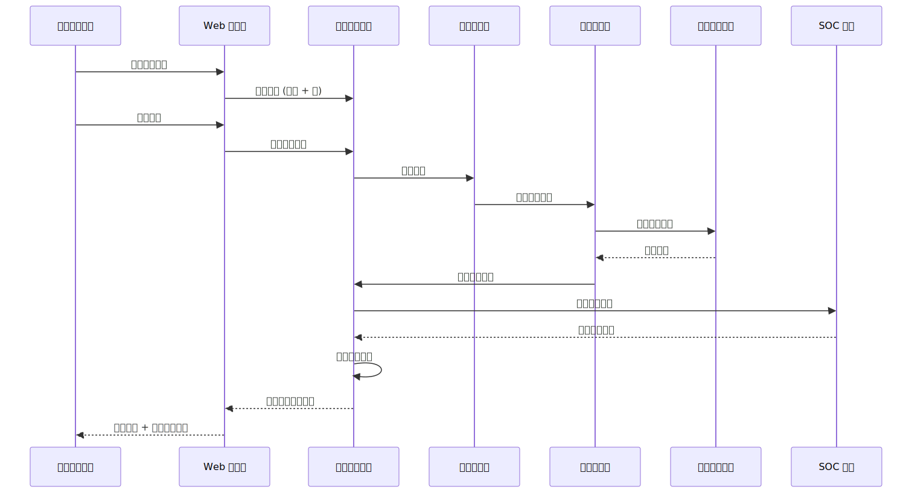

### 2.4.2 动态用例集实时联动

用例库更新后，新增用例如何自动进入既有场景：

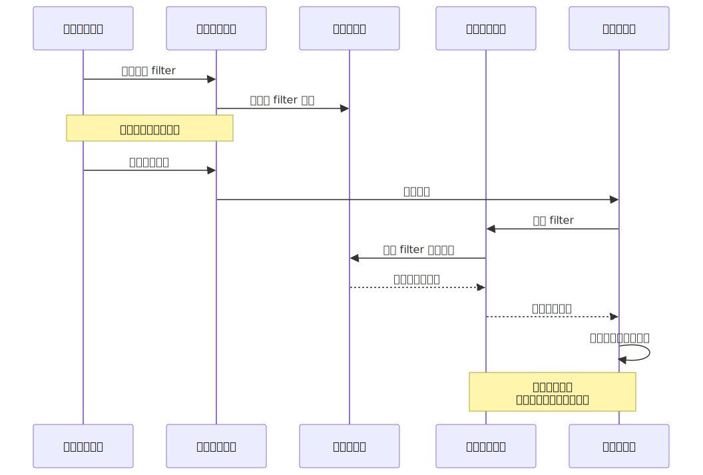

## 2.5 组件依赖

下表汇总了平台各组件的依赖关系：

| 组件 | 同步依赖 | 异步依赖 | 部署形态 |
| --- | --- | --- | --- |
| 平台核心服务 | PostgreSQL / Elasticsearch / MinIO | RabbitMQ | 容器 |
| 任务调度器 | PostgreSQL | — | 内嵌核心服务进程 |
| 节点执行器 | 攻击控制框架 / 主机 Agent | — | 多实现适配 |
| SOC 关联模块 | SIEM 系统 | — | 多 SIEM 适配 |
| 流量回放设备 | 平台接入网关（回调） | 异步通知 | 独立硬件，IPv6 双栈接入 |
| 沙箱执行环境 | 平台接入网关 | 报告轮询 | 独立集群，接口集成 |

## 2.6 数据模型版本管理

平台对数据结构变更采用严格的版本化管理：

- 每次变更生成独立的迁移脚本，包含版本号、变更描述与具体内容
- 迁移脚本与应用代码同步纳入版本管理
- 应用启动时自动校验版本一致性

该机制保证了数据模型在持续演进过程中的可追溯性、可重现性，避免任何版本错位风险。

---

# 第三章 硬件与部署

本章阐述平台的硬件规格、网络拓扑与部署形态，覆盖业务需求对硬件指标的满足情况、各网络接口分配建议、IPv6 双栈支持等关键内容。

## 3.1 硬件要求

### 3.1.1 硬件规格满足情况

平台完整支持业务需求中规定的全部硬件指标：

| 硬件指标 | 业务需求 | 平台支持 | 说明 |
| --- | --- | --- | --- |
| 设备形态 | 2U 机架式 | 完全支持 | 适配主流国产化品牌 2U 机架式服务器 |
| CPU | 国产化 CPU | 完全支持 | 适配鲲鹏、海光、飞腾、龙芯等主流国产 CPU 架构 |
| 内存 | 128G | 完全支持 | 推荐 DDR4 ECC 内存 |
| 硬盘 | 960G × 2 | 完全支持 | 推荐企业级 SSD，RAID 1 冗余配置 |
| 网络接口 | 2 端口 10GE 光接口 + 2 端口 1GE 电接口 | 完全支持 | 10GE 用于数据平面，1GE 用于管理平面 |

### 3.1.2 标准硬件配置

| 项 | 规格 |
| --- | --- |
| 设备形态 | 2U 机架式 |
| CPU | 国产化 CPU |
| 内存 | 128GB DDR4 ECC |
| 系统盘 | 960GB 企业级 SSD × 2（RAID 1） |
| 网络接口 | 2 × 10GE 光口 + 2 × 1GE 电口 |
| 电源 | 冗余电源（1+1） |
| 操作系统 | 主流国产化 Linux 发行版（如统信 UOS、麒麟 OS） |

## 3.2 网络拓扑

### 3.2.1 标准部署网络拓扑

平台与外部组件通过两类网络互联：管理网络（1GE）用于运维与用户访问，数据平面（10GE）承载与流量回放设备、沙箱、SIEM 等外部组件的高速通信。



### 3.2.2 网络接口分配建议

业务需求中的四个网络接口建议按如下方式分配：

| 接口 | 速率 | 用途 |
| --- | --- | --- |
| 接口 1 | 10GE | 与流量回放设备、沙箱、SIEM 系统的高速数据传输 |
| 接口 2 | 10GE | 备用 / 链路聚合（LACP） |
| 接口 3 | 1GE | 平台管理网络、运维访问 |
| 接口 4 | 1GE | 用户访问网络、Web 控制台 |

### 3.2.3 IPv6 网络支持

平台原生支持 IPv6 双栈部署，IPv6 能力贯穿全链路：

- Web 控制台与外部系统接入入口均监听 IPv6 双栈地址
- 与外部组件（流量回放设备、HIDS Agent、SIEM、沙箱）的通信全链路支持 IPv6
- 攻击用例本身支持 IPv6 目标，并支持多 IPv6 四元组场景（详见 [§ 6.1](#61-流量安全验证)）
- DNS、邮件、Webhook 等附属能力均支持 IPv6 地址

## 3.3 部署形态

平台采用一体化容器化部署，全部核心组件运行于一台 2U 机架式服务器上：

- **环境一致性**：开发、测试、生产环境完全一致
- **资源隔离**：容器间资源限制清晰、互不干扰
- **版本管理**：组件版本通过镜像 tag 严格管理

### 3.3.1 部署组件清单

| 组件 | 默认端口 | 数据持久化 |
| --- | --- | --- |
| 平台核心服务 + 调度器 | 8080 | 配置 / 日志 |
| 前端控制台 | 80 / 443 | 静态资源 |
| 关系数据库（PostgreSQL） | 5432 | 数据库文件 |
| 搜索引擎（Elasticsearch） | 9200 | 索引文件 |
| 对象存储（MinIO） | 9000 | 对象数据 |
| 消息队列（RabbitMQ） | 5672 / 15672 | 队列数据 |
| 攻击控制框架 | — | 配置文件 |

## 3.4 安装与初始化

### 3.4.1 安装流程

平台部署遵循标准化流程，从硬件就位到投入使用，操作步骤清晰：

### 3.4.2 初始化配置项

| 配置类别 | 配置内容 |
| --- | --- |
| 网络 | 平台访问地址、IPv6 双栈配置、TLS 证书 |
| 存储 | 数据库连接、对象存储凭据 |
| 集成 | SIEM 系统接入参数、流量回放设备地址、沙箱后端配置 |
| 安全 | 管理员初始账号、密码策略、登录尝试限制 |

---

# 第四章 数据架构

本章阐述平台的数据组织结构、存储策略与数据安全保护方案。

## 4.1 数据存储分层

平台数据按照"用途、特性、访问模式"分层存储，每类数据由最合适的存储引擎承载，避免一种存储承担多种职责带来的性能与维护问题：



## 4.2 关系数据模型

### 4.2.1 核心实体关系

下图展示了平台的核心业务实体及其关系，帮助读者理解平台数据组织的整体结构：



### 4.2.2 核心实体一览

| 实体 | 用途 | 详见 |
| --- | --- | --- |
| 用户 / 团队 | 身份与归属 | [§ 7.1](#71-用户与权限管理) |
| 资产 / 资产组 | 攻击目标 | [§ 7.2](#72-资产管理) |
| 用例契约 / 攻击模式 / 杀伤链阶段 / 载荷 | 用例库内容 | [§ 7.3](#73-用例库管理) |
| 攻击链路 / 节点 / 边 | 攻击编排定义 | [§ 6.4](#64-攻击编排) |
| 链路运行 / 节点期望 / 链路期望 | 任务执行与结果 | [§ 6.4](#64-攻击编排)、[§ 7.6](#76-任务历史与验证记录) |
| 验证参数集 | 验证参数复用 | [§ 6.3](#63-自定义验证)、[§ 6.4](#64-攻击编排) |
| SOC 连接器 | SIEM 告警关联配置 | [§ 6.4](#64-攻击编排) |
| 沙箱 / 沙箱运行 | 沙箱实例与执行记录 | [§ 6.5](#65-沙箱管理) |

## 4.3 搜索与分析数据

平台在关系型数据库之外，还使用 Elasticsearch 承担全文搜索、聚合分析、时间序列查询等场景，让用户能快速从海量数据中找到所需信息。

### 4.3.1 索引规划

| 索引名 | 用途 | 分片策略 |
| --- | --- | --- |
| node-contracts | 用例契约全文搜索（标题、描述、标签）| 单分片，多副本 |
| attack-patterns | ATT&CK 攻击模式聚合查询 | 单分片，多副本 |
| runs-history | 历史运行验证结果时间序列 | 按月分片 |
| findings | 验证发现项、告警关联记录 | 按月分片 |
| audit-logs | 审计日志全文检索 | 按月分片 |

### 4.3.2 数据同步机制

- 关系数据库是权威数据源
- 数据变更同步写入搜索引擎
- 支持全量重建索引，作为容灾保障手段
- 搜索结果与权限模型联动，用户无权限的数据不会进入结果集

## 4.4 对象存储数据

样本文件、pcap 流量包、报告附件等非结构化数据由独立的对象存储承载，避免占用关系数据库空间，同时支持大文件高效访问。

### 4.4.1 对象分类

| 桶名 | 用途 | 生命周期策略 |
| --- | --- | --- |
| samples | 恶意样本文件（沙箱执行用） | 长期保留，按需归档 |
| pcaps | pcap 流量包（流量验证用） | 长期保留，按需归档 |
| reports | 任务执行报告 | 按客户保留策略配置 |
| imports | 用例批量导入临时文件 | 短期保留 |
| attachments | 各类附件（用例文档、配置等） | 跟随关联实体生命周期 |

### 4.4.2 大文件支持

- **分块上传**：自动分块、断点续传
- **并发下载**：支持范围请求，加速大文件下载
- **完整性校验**：上传时计算 SHA-256 校验码，下载时比对
- **大小上限**：可配置，按客户需求规划

## 4.5 数据保留策略

平台对各类数据提供独立的保留期配置项，客户可根据合规要求与存储规划灵活调整：

| 数据类别 | 保留特性 |
| --- | --- |
| 链路任务执行记录 | 按客户合规要求配置，支持永久保留 |
| 节点期望与验证结果 | 跟随任务记录的保留策略 |
| 审计日志 | 满足等保合规要求，支持长期 / 永久保留 |
| 操作日志 | 按客户运维策略配置 |
| 样本与 pcap 文件 | 默认永久，支持手动归档 |
| 导入临时文件 | 短期自动清理 |

超过保留期的数据自动进入归档流程，归档数据移至冷存储区，仍保持可检索性。

## 4.6 数据备份能力

平台具备完整的数据备份能力，覆盖各类核心数据，备份策略可按客户业务连续性要求灵活配置：

| 备份对象 | 备份方式 |
| --- | --- |
| 关系数据库 | 全量 + 增量备份机制 |
| Elasticsearch 索引 | 快照机制 |
| 对象存储 | 跨节点冗余 + 异地备份 |
| 配置文件 | 版本管理 + 备份 |

## 4.7 数据安全

数据安全贯穿平台数据生命周期的全部环节：

| 维度 | 控制措施 |
| --- | --- |
| 传输加密 | 全部对外接口 TLS 1.3，组件间通信支持加密 |
| 存储加密 | 数据库表空间加密（可选）、对象存储服务端加密 |
| 凭据管理 | 数据库密码、对象存储凭据等敏感配置加密存储 |
| 数据脱敏 | 导出功能支持敏感字段脱敏 |
| 访问控制 | 数据库账号最小权限、对象存储桶级访问控制 |

---

# 第五章 可观测性

本章阐述平台内置的可观测性能力，包括结构化日志、健康检查、指标暴露与外部监控平台对接方式。可观测性能力可保证客户在日常运营中随时掌握平台运行状态。

## 5.1 可观测性体系

平台提供日志、健康检查、指标三类可观测性能力。日志承担运行明细与审计追溯，健康检查承担状态自检与依赖巡视，指标承担运行趋势与外部对接：



## 5.2 日志能力

### 5.2.1 结构化日志

平台采用结构化 JSON 格式输出日志，每条日志为独立 JSON 对象，便于程序化解析与检索：

| 字段 | 说明 |
| --- | --- |
| timestamp | 时间戳（ISO 8601 格式） |
| level | 日志级别（DEBUG / INFO / WARN / ERROR） |
| logger | 产生日志的组件 |
| thread | 线程名 |
| message | 日志消息 |
| exception | 异常堆栈（如有） |

日志通过容器标准输出统一输出，可由容器编排工具采集，并对接客户既有日志平台（如 ELK、Graylog、Loki 等），无需在平台内额外部署日志组件。

### 5.2.2 审计日志

平台内置完整的审计日志能力，对核心业务实体的创建、变更、删除事件进行结构化记录：

- 自动记录创建时间、更新时间、操作主体
- 关键资源（用户、角色、权限策略、链路、用例契约等）的变更全部留痕
- 审计数据持久化至关系数据库，支持长期保留与检索
- 详细审计模型与查询能力详见 [§ 7.5](#75-审计日志)

### 5.2.3 任务执行日志

每一次链路任务运行的完整执行轨迹（节点状态、执行时间、验证结果）均独立留存：

- 任务级元数据：开始 / 结束时间、最终验证结果、关联用户
- 节点级明细：每个节点的执行状态、期望结果、实际结果
- 历史可回放：详见 [§ 7.6](#76-任务历史与验证记录)

## 5.3 健康检查

平台提供标准化的健康检查能力，便于运维系统、负载均衡器、容器编排工具进行存活与就绪判断：

| 检查项 | 用途 |
| --- | --- |
| 平台整体健康状态 | 反映平台是否可正常对外提供服务 |
| 平台版本与构建信息 | 反映当前运行版本，便于运维巡检 |

健康检查自动覆盖以下依赖项：

- 关系数据库连接
- 搜索引擎集群状态
- 对象存储可访问性
- 消息队列连接
- 磁盘空间

任一依赖项异常都会反映在健康检查结果中，便于及时发现问题。

## 5.4 指标暴露

平台通过标准 Prometheus 格式暴露运行时指标：

| 指标通道 | 用途 |
| --- | --- |
| Prometheus 格式指标 | 提供给监控平台拉取 |

平台默认暴露的指标涵盖以下方面：

- **应用运行指标**：JVM 内存、垃圾回收、线程池
- **接入流量指标**：请求量、响应时间分布、错误率
- **数据库连接池指标**：活跃连接、空闲连接、等待数
- **缓存与异步任务指标**：执行计数、耗时分布

客户可使用既有的监控平台（如 Prometheus + Grafana、Zabbix、夜莺等）直接拉取这些指标，建立趋势分析与可视化面板。

## 5.5 外部监控平台对接

平台不强制绑定特定的监控告警体系，而是通过开放方式与客户既有运维平台对接：

| 数据类型 | 暴露方式 | 推荐对接 |
| --- | --- | --- |
| 日志 | 容器标准输出 | 客户既有日志平台（ELK / Graylog / Loki 等） |
| 健康状态 | 健康检查通道 | 容器编排健康检查、负载均衡器探针、运维巡检 |
| 运行指标 | Prometheus 格式指标通道 | Prometheus + Grafana 等监控可视化平台 |

这种开放式设计的优势：

- 客户无需引入新的监控体系，复用现有投资
- 数据归集到客户统一运维平台，便于跨系统关联分析
- 告警规则、阈值、通知通道完全由客户在自有平台配置，符合既有运维流程

---

# 第六章 核心业务功能

## 6.1 流量安全验证

本节验证客户网络边界部署的检测设备（NTA、IDS 等）对各类流量侧攻击的真实防护效用。

### 6.1.1 模块定位

流量安全验证是平台的核心能力之一。安全运营人员通过本模块可以回答以下关键问题：

- **覆盖度问题**：网络边界部署的检测设备，到底覆盖了哪些资产？哪些资产是检测盲区？
- **稳定性问题**：检测设备是否长期稳定工作？最近一段时间的检出率有无下滑？
- **有效性问题**：对反弹 shell、暴力破解、远控木马等典型攻击，检测设备是否真能拦得住、告得出？

平台通过持续、自动、可量化的流量回放验证，让网络边界防御能力的真实状态变得可视、可测、可证。

### 6.1.2 网络边界资产覆盖度验证

平台对客户网络中的全部资产建立结构化清单，并以可视化矩阵的形式展示每个资产被流量检测设备及其策略覆盖的情况：

- **资产 - 设备覆盖矩阵**：横轴为资产、纵轴为检测设备，矩阵格指示是否被覆盖
- **资产 - 策略覆盖矩阵**：横轴为资产、纵轴为具体检测策略，精细到策略级别
- **覆盖缺口高亮**：未被任何设备覆盖、或未被关键策略覆盖的资产以高亮方式显示
- **覆盖度汇总**：按业务系统、网段、资产类型多维度汇总覆盖率

### 6.1.3 流量安全设备稳定性验证

平台支持创建周期性稳定性验证任务，对检测设备的长期工作状态进行趋势化跟踪：

- **任务编排**：设定验证频率（如每日 / 每周 / 自定义周期）、目标设备、用例集
- **稳定性趋势图**：横轴为时间、纵轴为检出率，可视化展示设备性能变化

### 6.1.4 流量侧攻击防护效用验证

平台内置覆盖以下 11 种流量侧攻击类型的丰富用例库：

| 攻击类型 | 用例典型示例 |
| --- | --- |
| 暴力破解 | SSH / RDP / SMB / FTP / 数据库暴力破解 |
| 反弹 shell | Bash / Python / PowerShell / Netcat 反弹 |
| 内存注入 webshell | 内存马上传、内存马执行 |
| 隐秘隧道 | DNS 隧道、ICMP 隧道、HTTP 隧道、加密代理 |
| 恶意域名解析 | DGA 域名、已知 C2 域名、低信誉域名 |
| webshell 命令执行 | 各类语言 webshell 命令执行 |
| 高危漏洞利用 | 主流中间件 / 框架 / 操作系统漏洞利用 |
| 远控木马执行 | 主流远控家族 C2 通信流量 |
| 权限绕过 | 认证绕过、授权绕过、目录穿越 |
| 未授权访问 | 数据库、管理后台、API 未授权访问 |
| 信息泄露 | 敏感配置泄露、源代码泄露、备份文件泄露 |

平台支持验证 NTA、IDS 等主流流量安全设备和策略对上述攻击类型的防护效用，用例总数量满足"不低于 300 个"的标准，并持续扩充。

### 6.1.5 多端口四元组用例

平台支持在同一个流量安全验证用例中包含多个不同的四元组（源 IP、源端口、目的 IP、目的端口），满足复杂攻击场景的验证需要：

- 单用例支持配置多个四元组
- 各四元组独立指定源 / 目的地址与端口
- 支持 IPv6 / IPv4 / 混合四元组

### 6.1.6 模块组件关系



### 6.1.7 流量验证执行时序

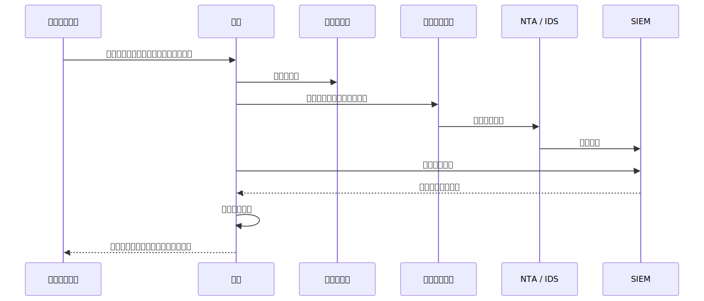

---

## 6.2 应用与服务器安全验证

本节验证客户主机上部署的安全设备（HIDS 等）对各类主机侧攻击的真实防护效用。

### 6.2.1 模块定位

应用与服务器安全验证模块聚焦于"主机这一层"的防御能力评估。如果说流量安全验证关注"网络边界看得见、拦得住吗"，那么本模块关注的是：

- 当攻击穿透了网络边界、落到主机上后，主机的防御能力如何？
- HIDS 是否能识别反弹 shell、提权、痕迹清理这些典型行为？
- 不同主机的安全 Agent 配置差异，是否导致防御能力参差不齐？

平台通过在被验证主机上轻量部署 Agent，按需触发各类主机侧攻击行为，验证 HIDS 等主机安全设备的实际检出能力。

### 6.2.2 主机侧攻击防护效用验证

平台内置覆盖以下 12 种主机侧攻击类型的丰富用例库：

| 攻击类型 | 用例典型示例 |
| --- | --- |
| 反弹 shell | Bash / Python / PowerShell / Netcat 多语言反弹 |
| webshell 上传落盘 | 各类语言 webshell 写入 web 目录 |
| 命令执行 | 通过漏洞或弱配置触发的命令执行 |
| 隧道代理 | SSH 隧道、SOCKS 代理、reGeorg 等代理工具 |
| 内存注入 webshell | 内存马注入到 Java / .NET / PHP 进程 |
| 暴力破解 | 系统账号、数据库账号、应用账号暴力破解 |
| 远控木马执行 | 主流远控家族客户端落地执行 |
| 系统提权 | Linux / Windows 各类提权技术 |
| 网站篡改 | 静态文件篡改、动态内容篡改、首页替换 |
| 病毒样本落盘 | 各类病毒样本写入磁盘 |
| 痕迹清理 | 日志清理、命令历史清理、文件时间戳篡改 |
| 主机持久化 | 计划任务、服务、启动项、注册表、cron 等多种持久化方式 |

平台支持验证 HIDS 等主流主机安全设备和策略对上述攻击类型的防护效用，用例总数量满足"不低于 300 个"的标准，并持续扩充。

### 6.2.3 模块组件关系



### 6.2.4 主机验证执行时序

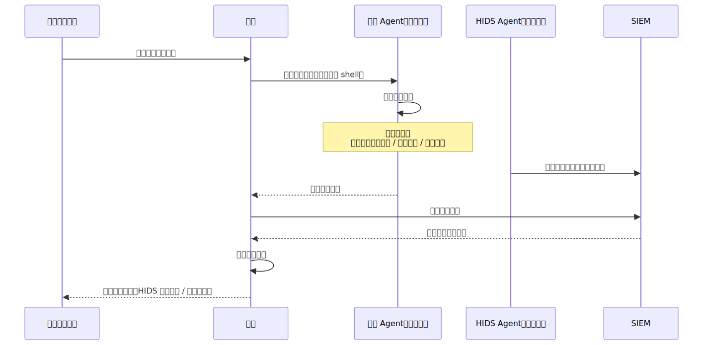

### 6.2.5 主机清单与目标选择

主机清单管理在 [§ 7.2 资产管理](#72-资产管理) 中统一维护，本模块直接复用：

- 单主机验证：指定单台目标主机
- 主机组验证：通过资产组批量选择目标
- 动态目标选择：通过 filter（如操作系统、业务系统标签）实时匹配目标

---

## 6.3 自定义验证

本节支持用户根据业务需要自定义验证场景、批量导入用例、设计多种类型的自定义用例，并通过动态筛选实现用例集随用例库自动联动。

### 6.3.1 模块定位

通用攻击场景验证解决的是"行业典型威胁"问题，而自定义验证解决的是"客户特定需求"问题。每个客户的业务系统、数据敏感度、合规要求都不同，平台必须支持客户：

- **构建自己的验证场景**：把若干用例按特定顺序组合，模拟真实业务受到的威胁
- **构造特定的用例**：当通用用例库不够用时，自己定制 web 攻击包、流量包、命令、邮件等
- **自动响应用例库变化**：用例库新增的用例如果符合场景条件，自动进入场景

平台为这三个需求分别提供完整支持。

### 6.3.2 自定义场景与执行顺序

平台支持用户自定义验证场景：

- **用例顺序自定义**：用户在可视化画布上手动设定场景内用例的执行顺序
- **基于 ATT&CK 维度自动划分**：场景内用例可按 ATT&CK 战术阶段（侦察、武器化、投递、利用、安装、命令与控制、目标行动）自动归类
- **基于纵深防御维度自动划分**：场景内用例可按纵深防御层级（网络边界、主机端点、应用、数据等）自动归类
- **双维度切换**：用户可在 ATT&CK 视图与纵深防御视图之间一键切换

### 6.3.3 批量导入用例生成场景

平台支持通过批量导入用例的形式快速生成自定义场景：

- 支持结构化数据格式（CSV、JSON 等）批量导入用例
- 导入时可同步设定场景元数据（名称、描述、标签）
- 导入过程支持校验、预览、确认
- 导入失败的条目独立标注，便于修正后重导

### 6.3.4 多种类型的自定义用例

平台支持以下 6 种类型的自定义用例：

| 用例类型 | 用途 | 关键能力 |
| --- | --- | --- |
| 构造 web 攻击包 | 自定义 HTTP/HTTPS 请求作为攻击载荷 | URL、方法、Header、Body、参数、Cookie 自由配置 |
| 上传 pcap 流量包 | 上传客户自有的 pcap 文件用于回放 | 文件上传、文件元数据、回放速率 |
| 上传样本文件 | 上传恶意样本文件（如病毒、木马）用于沙箱执行 | 文件上传、样本类型标注、沙箱选择 |
| 配置执行的命令 | 直接配置在目标主机上执行的命令 | 命令文本、参数、执行环境、超时 |
| 上传可执行文件并配置执行命令 | 上传可执行文件，执行时配套命令参数 | 文件上传、文件部署路径、启动命令 |
| 配置邮件形式 | 配置攻击邮件（钓鱼、附件、链接等） | 收件人、主题、正文、附件、内嵌链接 |

### 6.3.5 用例筛选生成验证场景

平台支持用户从全量用例库中通过筛选条件创建自定义验证场景：

- **多维筛选**：按 ATT&CK 攻击模式、杀伤链阶段、攻击类型、攻击载体、标签等多维度组合筛选
- **筛选结果预览**：实时显示当前筛选条件匹配的用例数量与列表
- **一键生成场景**：将筛选结果作为场景内容直接创建场景

### 6.3.6 动态用例集与实时联动

平台的动态用例集机制让场景与用例库形成实时联动：

- 场景中的用例范围由"筛选条件"定义，而非固定的用例列表
- 当用例库更新（新增用例）时，符合筛选条件的新用例自动进入场景
- 每次验证任务执行时，系统按当前用例库状态实时派生用例集
- 用户无需手动维护场景内容，场景始终保持"最新版本"

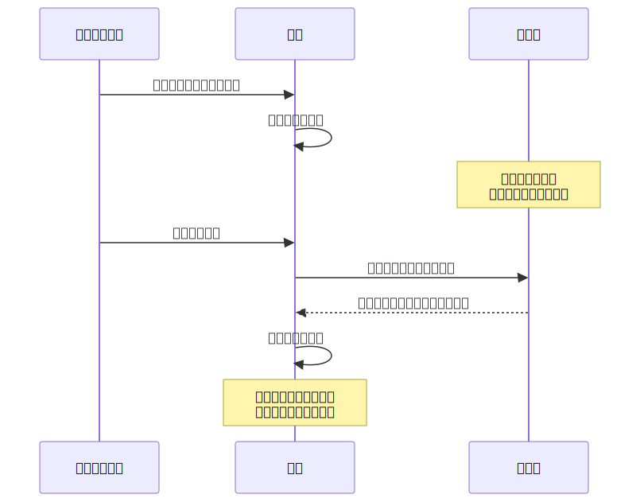

### 6.3.7 自定义场景的两类成员

平台的自定义场景支持"手动 + 动态"两类成员：



### 6.3.8 6 类自定义用例的统一抽象



无论是哪种类型，自定义用例都共享统一的基础属性，便于在场景内统一编排与结果评估。

### 6.3.9 场景执行的双轨融合

场景执行时，手动用例与动态用例在调度层面完全融合：

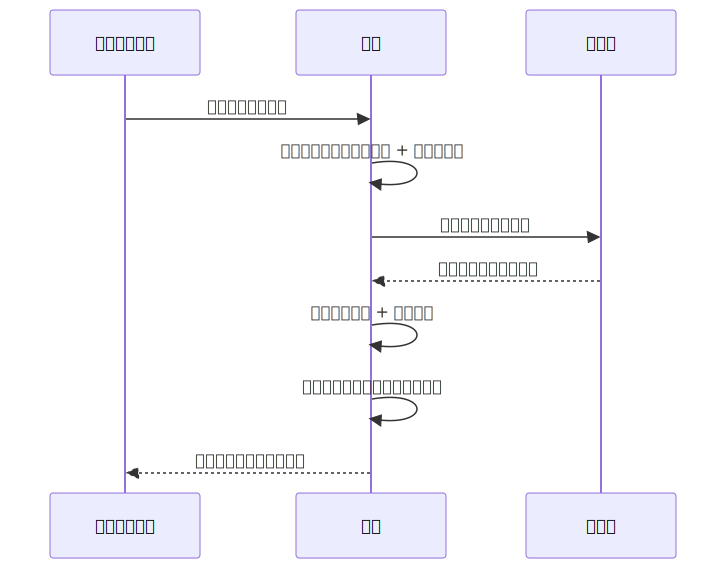

---

## 6.4 攻击编排

本节支持用户在可视化画布上构建多节点攻击链路，模拟真实复合攻击场景，并通过链路化执行验证整体防御体系的有效性。

### 6.4.1 模块定位

真实世界的高级攻击很少是"单点行为"，往往是"侦察 → 投递 → 利用 → 持久化 → 横向移动 → 数据外传"的多步链路。传统的单用例验证无法回答以下问题：

- 当攻击者在前置阶段已经成功时，后续阶段的防御能否补救？
- 不同阶段的检测设备之间，告警是否能正确关联？
- 整个防御纵深体系，在面对一次完整攻击时，最终是"全链路有效"、"部分失效"还是"全链路失效"？

攻击编排模块正是为回答这些问题而设计。安全运营人员通过可视化画布，把多个用例按"链路"形式组合，平台按用户定义的逻辑依次执行各节点，并对整个链路的最终防御效果做综合判定。

### 6.4.2 可视化链路编排

平台提供基于现代前端框架构建的可视化攻击编排画布：

- **拖拽式节点**：从用例库拖拽用例到画布即生成节点
- **可视化边连接**：节点间用鼠标拖拽建立执行依赖
- **画布交互**：支持缩放、平移、自动布局、节点搜索

### 6.4.3 节点用例自定义配置

每个节点对应一个具体用例，用户可在节点级别自定义：

- 用例选择：从用例库挑选具体用例
- 用例参数：覆盖用例的默认参数
- 目标资产：指定本节点的攻击目标
- 预期结果：本节点的验证期望

### 6.4.4 节点执行配置

每个节点支持灵活的执行行为配置：

| 配置项 | 含义 |
| --- | --- |
| **延迟执行** | 节点是否延迟执行，延迟时间（秒级精度） |
| **重复执行** | 节点是否重复执行 |
| **重复次数** | 重复执行的总次数 |
| **重复间隔** | 两次重复之间的时间间隔 |

这些配置便于模拟真实攻击中的"低频试探"、"集中爆破"等行为模式。

### 6.4.5 节点间执行逻辑

节点之间不仅有"先后顺序"，还有基于结果的"条件分支"：

- **执行依赖**：节点 B 必须在节点 A 执行完成后才能执行
- **条件分支**：节点 B 是否执行取决于节点 A 的执行结果（如"A 被拦截才执行 B"、"A 成功才执行 B"）
- **复合条件**：多个父节点状态的与 / 或组合作为子节点执行条件

### 6.4.6 全局与节点级验证参数

平台支持两个层级的验证参数配置：

- **全局参数集**：在链路任务级别配置，应用于全部节点
- **节点级参数**：单个节点可覆盖全局参数，使用独立的参数集
- **参数集复用**：参数集独立维护，多个链路任务可共享同一参数集

### 6.4.7 任务执行模式

平台支持两种链路任务执行模式：

- **拦截后继续**：任一节点被拦截后，链路仍继续执行后续节点
  - 适用于评估纵深防御能力（看后续防御层是否也能拦截）
- **拦截后停止**：任一节点被拦截后，立即停止整条链路
  - 适用于评估单点防御效果（一旦拦下就不必继续验证）

模式可在链路任务创建时选择。

### 6.4.8 SOC 关联告警验证

平台支持使用整个攻击链路验证客户 SOC 关联告警规则的有效性：

- 链路级 SOC 期望配置：定义整条链路应触发哪些关联告警规则
- 多 SOC 连接器适配：支持对接多种 SIEM 系统
- 告警匹配条件：可定义告警规则匹配的字段、时间窗口、关联关系
- 验证结果：明确指示每条关联规则是否在本次任务中触发

### 6.4.9 运行画布展示

链路任务执行过程中，平台通过运行画布实时展示每个节点的拦截和检测结果：

- 节点状态实时着色（成功 / 失败 / 部分失效 / 待评估）
- 拦截层与检测层的结果同时呈现
- 整体链路状态在画布顶部聚合显示
- 节点详情侧栏：点击节点查看详细执行记录、期望对比、关联告警

### 6.4.10 时间轴展示

除画布视图外，平台还提供时间轴视图，从时间维度展示任务执行细节：

- **横轴时间**：从任务开始到结束的完整时间线
- **纵轴节点**：所有节点按链路结构纵向排列
- **节点状态在时间轴上的位置**：直观呈现"何时开始 / 何时结束 / 持续多久"
- **期望与告警事件**：在时间轴上标记期望评估时间点与告警触发时间点

### 6.4.11 三态验证结果

平台对每个链路任务计算最终的整体验证结果：

| 验证结果 | 含义 |
| --- | --- |
| **全链路有效** | 链路上的关键节点均被防御体系拦截或检测到，防御体系整体有效 |
| **部分失效** | 链路上部分节点未被拦截或检测到，防御体系存在局部盲区 |
| **全链路失效** | 链路上的关键节点均未被拦截或检测到，防御体系整体失效 |

### 6.4.12 攻击链路数据模型



### 6.4.13 链路任务执行调度时序

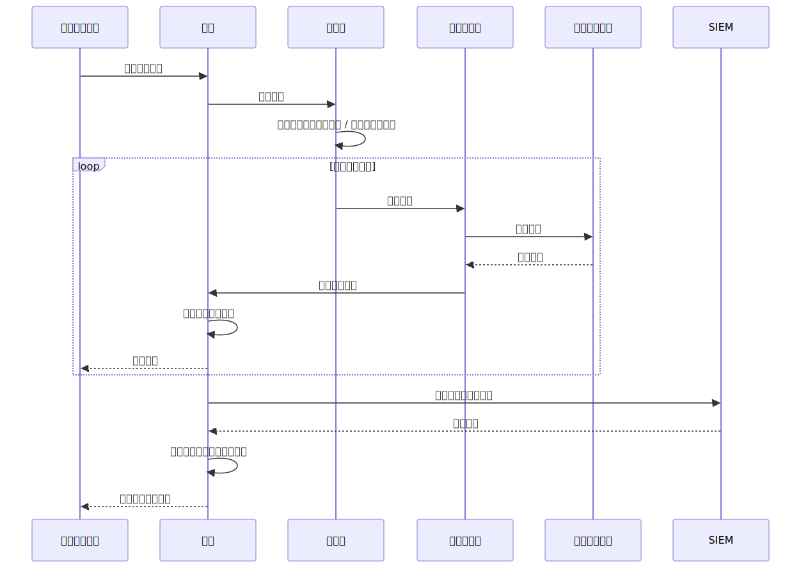

### 6.4.14 视图体系



两个视图同一份任务数据的不同呈现方式，便于客户从不同角度理解任务结果。

---

## 6.5 沙箱管理

本节提供沙箱环境的统一管理，支持在隔离环境中安全执行真实恶意样本，验证终端防御体系对真实威胁的响应能力。

### 6.5.1 模块定位

部分高威胁样本（如勒索病毒、挖矿病毒、内核驱动型恶意软件）只有真实执行才能触发完整的攻击行为，从而验证客户的终端安全能力。然而真实执行这些样本风险极高，必须在隔离的沙箱环境中进行。

沙箱管理模块解决以下问题：

- **如何安全运行真实恶意样本**：在隔离环境内执行，不影响生产网络与主机
- **如何管理多个沙箱环境**：平台需统一管理多个沙箱实例与各自的网络策略
- **如何避免样本污染环境**：每次执行完毕自动还原，确保下次执行的环境是干净的

### 6.5.2 真实恶意样本执行

平台支持在沙箱环境中执行真实恶意样本，覆盖以下多类样本：

| 样本类型 | 验证场景 |
| --- | --- |
| 勒索病毒样本 | 验证终端 EDR 对加密行为的检测与阻断能力 |
| 挖矿病毒样本 | 验证对持续高 CPU 占用、加密货币挖矿流量的识别能力 |
| 蠕虫病毒样本 | 验证对横向移动行为的检测与阻断能力 |
| 终端恶意驱动加载 | 验证对内核驱动安装、签名校验、Rootkit 行为的检测能力 |
| 终端权限提升 | 验证对各类提权技术的检测能力 |
| 终端系统账号窃取 | 验证对凭据窃取（如 LSASS 内存读取、SAM 文件操作）的检测能力 |
| 终端代理执行 | 验证对 LOLBins、远控代理等代理执行技术的识别能力 |
| 终端安全组件对抗 | 验证对杀软对抗、安全产品禁用、自我保护机制的识别能力 |

样本执行过程中，平台收集行为指标（进程、文件、网络、注册表操作）与终端安全产品的告警事件，综合评估防御效果。

### 6.5.3 沙箱平台 CRUD 管理

平台提供沙箱实例的完整生命周期管理：

| 操作 | 能力 |
| --- | --- |
| **新建** | 在平台中注册新的沙箱实例，配置基础信息（名称、类型、接入地址、凭据等） |
| **编辑** | 修改沙箱实例的配置 |
| **删除** | 注销不再使用的沙箱实例 |
| **查看** | 查看沙箱实例列表、详情、当前状态、历史执行记录 |

### 6.5.4 网络访问控制策略

平台支持为每个沙箱配置网络访问控制策略，确保样本执行期间产生的网络行为不会逃逸出沙箱：

| 策略维度 | 配置内容 |
| --- | --- |
| **出站策略** | 沙箱内进程可访问的外部地址白名单 / 黑名单 |
| **入站策略** | 允许从外部访问沙箱的来源限制 |
| **DNS 控制** | DNS 查询是否允许、解析结果劫持 |
| **协议限制** | 允许的网络协议（HTTP / HTTPS / DNS / 其他） |
| **流量速率** | 流量速率限制，防止 DDoS 类样本影响外部网络 |

策略以可视化界面配置，下发到沙箱后端生效。

### 6.5.5 用例执行后自动还原

每次用例执行完成后，沙箱环境自动还原至基线状态，保证下一次执行的环境是干净的：

- 基于快照机制的环境还原
- 还原过程包括文件系统、注册表、进程列表、网络配置
- 还原完成后，沙箱状态自动切回"就绪"，可接收下一次任务

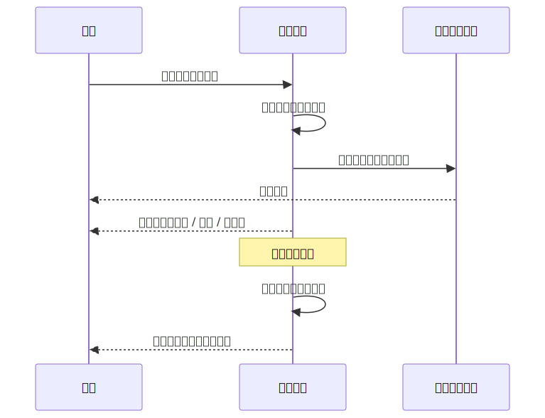

### 6.5.6 模块组件关系



### 6.5.7 沙箱实例生命周期



### 6.5.8 网络策略下发

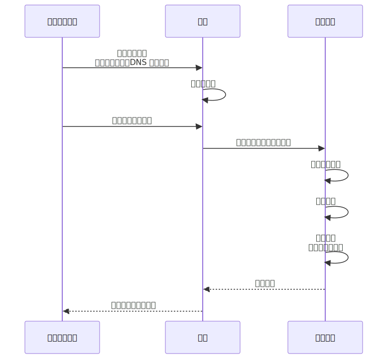

---

# 第七章 系统级功能

## 7.1 用户与权限管理

本节为平台提供完整的身份管理与访问控制能力，确保不同角色的用户在各自职责范围内安全、合规地使用平台。

### 7.1.1 模块定位

安全验证平台承载着大量敏感能力：攻击用例的执行、生产网络资产的访问、SIEM 告警系统的查询、沙箱样本的运行等。任何一项能力被错误的人使用都可能造成严重后果。用户与权限管理模块解决以下问题：

- **谁能登录平台？** —— 身份管理
- **每个用户能做什么？** —— 角色与权限
- **谁能访问哪些资源？** —— 资源级授权

平台采用业界成熟的 RBAC 模型，结合资源级授权机制，实现细粒度的访问控制。

### 7.1.2 用户管理

平台支持完整的用户生命周期管理：

| 能力 | 内容 |
| --- | --- |
| 用户创建 | 邮箱、用户名、姓名、所属团队、初始角色 |
| 用户编辑 | 修改基础信息、所属团队、角色分配 |
| 用户停用 | 临时禁用用户账号，禁用期间无法登录 |
| 用户删除 | 注销用户账号，关联数据按策略保留或匿名化 |
| 密码策略 | 复杂度要求、过期周期、历史密码复用限制 |
| 多因素认证 | 可选启用（如 TOTP） |
| 单点登录 | 支持对接客户既有的统一身份认证系统 |

### 7.1.3 角色管理

平台采用基于角色的访问控制（RBAC）模型：

- **预置角色**：平台预置若干常用角色（如管理员、安全运营、审计员、只读用户等），覆盖典型岗位职责
- **自定义角色**：客户可基于实际组织架构创建自定义角色，灵活组合权限
- **角色权限编辑**：每个角色对应一组权限点（动作 × 资源类型），可视化编辑
- **角色多人共享**：一个角色可分配给多个用户，权限统一变更

### 7.1.4 权限模型

平台权限以"动作 × 资源类型"二维模型表达：

| 维度 | 取值示例 |
| --- | --- |
| 动作 | 创建、读取、更新、删除、执行、授权等 |
| 资源类型 | 攻击链路、用例契约、资产、用户、报告等 |

例如"对攻击链路的执行权限"、"对用例契约的创建权限"等都是独立的权限点。

权限检查在每次接口调用时由平台核心自动完成，业务代码无需重复编写权限校验逻辑。

### 7.1.5 团队管理

团队是平台内更细的协作单元：

- 一个用户可参与多个团队
- 资源可授权给团队整体，便于团队协作
- 团队管理员可在团队内分配权限

### 7.1.6 资源级授权（Grants）

除基于角色的权限外，平台还支持资源级显式授权：

- 可对单个资源（如某条攻击链路）授予特定用户 / 团队访问权限
- 适用于跨角色的临时授权、特定资源的细粒度共享等场景
- 授权动作全程记入审计日志，可追溯



### 7.1.7 身份与权限模型



### 7.1.8 权限检查时序

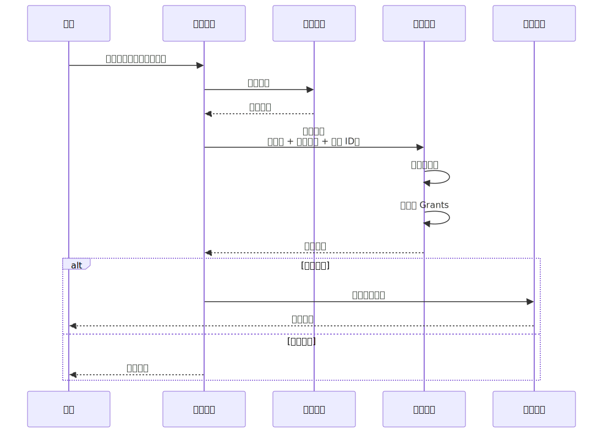

---

## 7.2 资产管理

本节为平台提供资产清单与资产组管理能力，是流量验证、主机验证、攻击编排等核心功能的目标基础。

### 7.2.1 模块定位

安全验证活动必须有明确的"目标"。无论是验证流量检测设备对哪些资产生效，还是在哪些主机上模拟攻击行为，平台都需要先有一份准确的资产清单。资产管理模块解决以下问题：

- **平台知道客户网络里有哪些资产吗？** —— 资产清单维护
- **怎么按业务、操作系统等维度组织资产？** —— 标签与分组
- **新增 / 下线资产时，验证场景如何自动跟随？** —— 动态资产组

### 7.2.2 资产清单

平台支持以下资产类型：

| 资产类型 | 用途 | 关键属性 |
| --- | --- | --- |
| 主机资产（Endpoint） | 主机验证、攻击编排目标 | IP（IPv4 / IPv6）、主机名、操作系统、Agent 状态 |
| 通用资产（Asset） | 各类网络与基础设施目标 | 名称、类型、IP、标签 |

### 7.2.3 资产清单管理

| 能力 | 内容 |
| --- | --- |
| 单个新增 | 通过表单逐个录入资产 |
| 编辑修改 | 修改资产元数据、标签 |
| 删除 / 停用 | 对下线资产做注销处理 |
| 搜索筛选 | 按 IP、主机名、标签、操作系统等多维筛选 |
| 资产标签 | 自由打标，便于跨维度组织资产 |

### 7.2.4 资产组

资产组是资产的逻辑集合，便于在验证场景中批量选择目标。平台支持两种成员模式：

**静态成员**

- 用户手动指定哪些资产属于该组
- 成员变更需手动维护
- 适用于稳定的资产集合

**动态成员**

- 用户设置筛选条件（如"所有 Linux 主机"）
- 平台按筛选条件实时匹配资产作为成员
- 资产清单更新时，动态组成员自动跟随更新
- 适用于规模化场景与持续变化的环境



### 7.2.5 主机 Agent 管理

对于主机资产，平台支持轻量级 Agent 的统一管理：

| 能力 | 内容 |
| --- | --- |
| Agent 注册 | 主机部署 Agent 后自动注册至平台 |
| Agent 状态 | 在线 / 离线 / 异常状态展示 |
| Agent 通信加密 | Agent 与平台之间的通信全链路加密 |

### 7.2.6 资产数据模型



### 7.2.7 资产组动态成员匹配

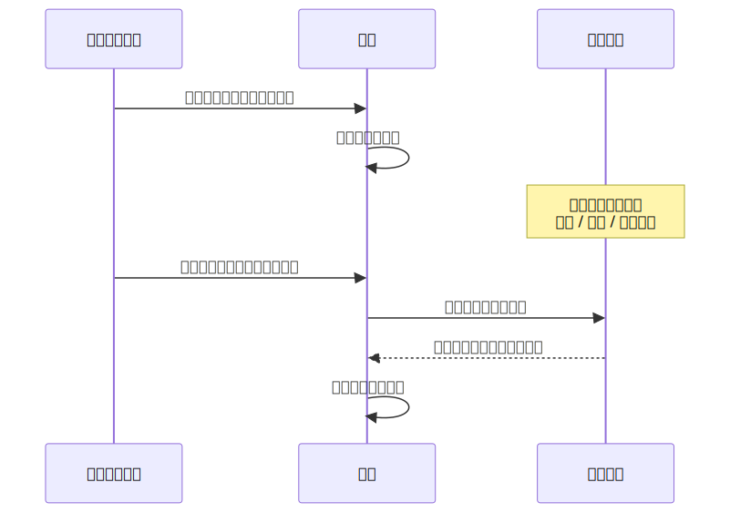

---

## 7.3 用例库管理

本节管理平台的全部攻击验证用例，是流量验证、主机验证、自定义验证、攻击编排等模块的内容基础。

### 7.3.1 模块定位

用例是平台一切验证活动的"原材料"。一个完整、准确、最新的用例库决定了平台能验证什么、验证得多准。用例库管理模块解决以下问题：

- **怎么组织成千上万的用例？** —— 用例分类与索引
- **怎么让用例与 ATT&CK 等行业标准对齐？** —— 知识库关联
- **怎么管理执行用例所需的载荷文件？** —— 攻击载荷管理
- **怎么让用例支持持续扩充？** —— 用例导入与维护

### 7.3.2 用例契约

每个用例在平台中表达为一个"用例契约"，描述用例的全部元数据与执行要求：

| 元数据维度 | 内容 |
| --- | --- |
| 基础信息 | 名称、描述、标签、多语言标签 |
| 攻击属性 | 所属攻击类型、攻击载体（流量 / 主机 / 邮件 / 沙箱）、可执行平台 |
| 知识库关联 | ATT&CK 攻击模式、杀伤链阶段 |
| 执行配置 | 默认参数、可配置参数、预期结果 |
| 载荷关联 | 关联的攻击载荷（如有） |

### 7.3.3 攻击载荷管理

部分用例的执行需要附带载荷文件，平台对载荷做统一管理：

| 载荷类型 | 用途 |
| --- | --- |
| 命令载荷 | 在目标主机执行的命令文本 |
| 文件载荷 | 上传到目标主机的可执行文件、脚本等 |
| 流量载荷 | 在网络上重放的 pcap 流量包 |
| 样本载荷 | 在沙箱中执行的恶意样本 |
| Web 攻击载荷 | HTTP / HTTPS 请求构造数据 |
| 邮件载荷 | 邮件正文、附件、内嵌链接 |

载荷与用例契约关联，便于在不同用例间复用同一载荷。

### 7.3.4 ATT&CK 攻击模式库

平台内置完整的 ATT&CK 攻击模式库：

- **战术（Tactic）**：覆盖侦察、武器化、投递、利用、安装、命令与控制、目标行动等
- **技术（Technique）**：每个战术下的具体技术
- **子技术（Sub-Technique）**：技术的进一步细化
- **平台关联**：每个技术对应的目标平台（Windows / Linux / macOS / 容器等）
- **检测建议**：每个技术的检测策略建议

用例通过关联 ATT&CK 攻击模式，让验证活动与行业标准对齐，便于评估防御覆盖度。

### 7.3.5 杀伤链阶段

平台内置完整的杀伤链（Kill Chain）阶段定义，用例可关联到具体阶段：

- 侦察、武器化、投递、利用、安装、命令与控制、目标行动

杀伤链与 ATT&CK 配合使用，从两个不同视角观察用例的覆盖度。

### 7.3.6 用例分类与搜索

| 能力 | 内容 |
| --- | --- |
| 多维分类 | 按攻击类型、攻击载体、ATT&CK 战术、杀伤链阶段、标签等多维分类 |
| 全文搜索 | 在用例名称、描述、标签中全文搜索 |
| 过滤组合 | 多个过滤条件可组合（与 / 或） |
| 列表 / 矩阵视图 | 列表视图、ATT&CK 矩阵视图、杀伤链视图自由切换 |

### 7.3.7 用例导入与维护

| 能力 | 内容 |
| --- | --- |
| 手动创建 | 通过表单创建单个用例 |
| 批量导入 | 通过结构化文件批量导入用例 |
| 用例版本 | 用例修改有版本化记录，便于回溯 |
| 用例上下架 | 测试中的用例可标记为"草稿"，生产用例可标记为"已发布" |

### 7.3.8 标签管理

用例标签是跨用例的轻量级组织工具：

- 全局标签库统一维护
- 一个用例可打多个标签
- 标签可作为筛选维度
- 标签随用例库一起导入 / 导出

### 7.3.9 文档与附件

用例可关联说明文档、技术参考资料、截图等附件：

- 支持多种文件格式
- 文档与用例关联，便于团队成员理解用例背景
- 支持团队协作（多人编辑、版本记录）

### 7.3.10 用例库数据模型



### 7.3.11 用例选择与匹配



### 7.3.12 ATT&CK 矩阵视图



---

## 7.4 报告与仪表板

本节为平台提供数据可视化能力，将海量验证活动数据转化为可阅读、可分析的洞察。

### 7.4.1 模块定位

安全验证平台每日产生大量数据：用例执行结果、验证结果、告警关联、攻击链路状态等。这些原始数据本身价值有限，只有经过聚合、可视化呈现后才能支持安全运营人员做出有效决策。报告与仪表板模块解决以下问题：

- **如何让分析师按需查看自己关心的数据？** —— 自定义仪表板
- **如何识别攻击穿透防御的关键路径？** —— 攻击路径分析
- **如何把数据交付给上下游系统？** —— 数据导出

### 7.4.2 自定义仪表板

平台支持用户根据自身需求创建自定义仪表板：

- 在仪表板画布上自由组合多个可视化组件
- 每个仪表板可关联独立的筛选条件（时间范围、业务系统等）
- 仪表板可保存、复用、在团队成员间共享

### 7.4.3 可视化组件

平台提供多种可视化组件供仪表板使用：

| 组件类型 | 用途 |
| --- | --- |
| 数值卡片 | 突出展示关键数值 |
| 时间趋势线 | 时间序列数据的趋势展示 |
| 饼图 / 环图 | 占比类数据 |
| 柱状图 / 条形图 | 多类别对比 |
| 表格 | 明细数据列表 |
| 热力图 | 二维数据密度展示（如 ATT&CK 矩阵覆盖度） |

### 7.4.4 攻击路径分析

针对攻击编排链路任务，平台提供专门的攻击路径分析能力：

- 展示一次攻击如何从起点经过多个节点到达终点
- 标注每个节点的拦截 / 检测状态
- 识别"防御穿透路径"：哪些路径上的节点全部失效

### 7.4.5 数据导出

平台支持原始数据导出，便于二次加工或对接客户既有数据平台：

- 验证任务执行记录导出
- 用例库内容导出
- 资产清单导出
- 导出格式支持 CSV、JSON 等结构化格式

### 7.4.6 仪表板架构



### 7.4.7 自定义仪表板创建流程

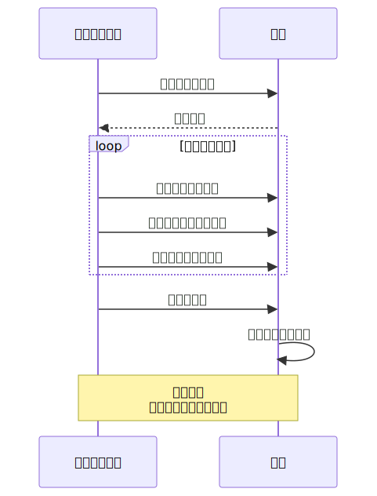

---

## 7.5 审计日志

本节为平台提供基础的操作审计能力，记录业务实体的变更事件与操作主体，便于事后追溯。

### 7.5.1 模块定位

安全验证平台承载着大量敏感操作：攻击用例执行、资产清单变更、用户权限调整、SOC 连接器配置等。任何一次操作都可能影响平台后续的验证活动与客户网络安全。审计日志模块解决以下问题：

- **谁在什么时间做了什么？** —— 操作记录
- **业务实体被谁修改了？什么时候？** —— 资源变更追溯

### 7.5.2 业务实体变更审计

平台对核心业务实体的创建、修改、删除事件进行结构化记录：

| 审计内容 | 含义 |
| --- | --- |
| 创建时间 | 实体首次创建的时间戳 |
| 最后更新时间 | 实体最近一次修改的时间戳 |
| 操作主体 | 触发变更的用户标识 |
| 实体类型 | 被变更的资源类型 |
| 实体标识 | 被变更资源的唯一标识 |

审计数据持久化至关系数据库，便于长期保留与追溯。

### 7.5.3 审计写入机制

审计数据由平台核心自动写入，无需业务代码显式调用：

- 业务实体生命周期事件（创建 / 更新 / 删除）由平台统一拦截
- 审计字段（时间、操作主体）自动收集并附加到实体
- 业务代码无需感知审计逻辑，确保审计覆盖的完整性

### 7.5.4 与日志体系协同

审计数据除持久化在数据库外，也通过平台日志体系输出：

- 关键操作以结构化日志形式记入应用日志
- 日志可对接客户既有的日志平台（如 ELK、Graylog、Loki 等）做集中归集与长期保留
- 详见 [§ 5 可观测性](#第五章-可观测性)

### 7.5.5 审计写入时序

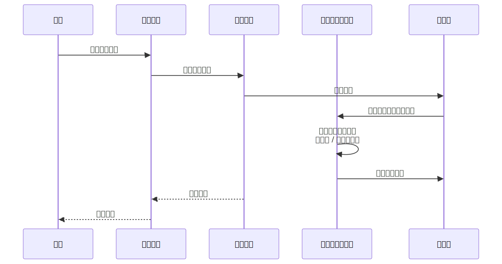

审计写入由平台自动触发，不依赖业务实现，确保覆盖完整。

---

## 7.6 任务历史与验证记录

本节为平台提供验证任务的全生命周期记录与查询能力，让每一次验证活动的过程与结果都可查、可回溯。

### 7.6.1 模块定位

安全验证是一个长期、持续的活动。一次验证任务执行完成、看到验证结果之后，并不是工作的终点 —— 客户还需要回答以下问题：

- 过去执行了哪些任务？分别对应什么场景？
- 某次任务的具体节点是哪个出了问题？
- 任务执行的完整时间线、关联告警、日志在哪里查？

任务历史与验证记录模块为这些问题提供完整支持。

### 7.6.2 任务列表

平台维护全部历史验证任务的完整列表：

| 列表维度 | 内容 |
| --- | --- |
| 任务基础信息 | 任务名称、关联场景 / 链路、创建人 |
| 执行时间 | 创建时间、开始时间、结束时间、耗时 |
| 任务状态 | 待开始、运行中、已完成、已取消、执行失败 |
| 验证结果 | 全链路有效 / 部分失效 / 全链路失效 |

任务列表支持多维筛选、排序、关键字搜索，便于快速定位历史任务。

### 7.6.3 任务详情

点击单个任务进入详情页，可查看完整的执行记录：

- **任务基础信息**：执行人、任务参数、所用场景版本
- **任务时间线**：从启动到结束的完整时间轴
- **节点执行明细**：每个节点的执行状态、用例参数、实际结果
- **验证结果**：节点级与链路级验证结果
- **关联告警**：本次任务在 SIEM 中触发的关联告警
- **执行日志**：详细的执行日志记录

### 7.6.4 任务数据模型



### 7.6.5 任务生命周期



### 7.6.6 任务详情视图



---

# 第八章 交付标准（验收指标）

本章明确项目的全部交付物清单与验收标准，作为项目终验的依据。验收指标以 [第六章](#第六章-核心业务功能) 与 [第七章](#第七章-系统级功能) 定义的功能模块为基础逐项对齐。

## 8.1 交付物清单

| 类别 | 交付物 | 形态 |
| --- | --- | --- |
| **平台软件** | 平台核心服务镜像 | 容器镜像 + 部署清单 |
| **平台软件** | 前端控制台资源包 | 静态资源 / 容器镜像 |
| **平台软件** | 数据库初始化与迁移脚本 | 版本化 SQL 脚本 |
| **平台软件** | 默认配置文件模板 | 配置文件 + 注释说明 |
| **初始数据** | ATT&CK 攻击模式库 | 数据库导入文件 |
| **初始数据** | 默认用例契约集合 | 数据库导入文件 |
| **初始数据** | 默认仪表板模板 | 配置文件 |
| **文档** | 部署运维手册 | Markdown / PDF |
| **文档** | 安全运营人员操作手册 | Markdown / PDF |
| **文档** | 用例库维护手册 | Markdown / PDF |
| **文档** | 数据备份与恢复手册 | Markdown / PDF |
| **文档** | 验收测试报告 | Markdown / PDF |
| **培训** | 管理员培训 | 现场 / 远程，1 次 |
| **培训** | 安全运营人员培训 | 现场 / 远程，1 次 |
| **质保** | 3 个月质保期支持 | 远程支持 + 现场支持（按需） |

## 8.2 功能验收指标

功能验收以本方案第六、七章定义的模块为单元逐项核验。下表汇总各模块的关键验收点；详细测试用例在 UAT 阶段形成《验收测试用例集》。

### 8.2.1 核心业务功能验收

| 模块 | 关键验收点 | 对应章节 |
| --- | --- | --- |
| **流量安全验证** | 网络边界资产覆盖度验证、流量回放设备稳定性验证、流量侧攻击防护效用验证、多端口四元组用例 | [§ 6.1](#61-流量安全验证) |
| **应用与服务器安全验证** | 主机侧多类攻击防护效用验证、主机 Agent 状态可见 | [§ 6.2](#62-应用与服务器安全验证) |
| **自定义验证** | 6 类自定义用例支持、批量导入、用例筛选生成场景、动态用例集实时联动 | [§ 6.3](#63-自定义验证) |
| **攻击编排** | 可视化链路编排、节点配置、执行逻辑、SOC 关联告警、运行画布、时间轴、三态验证结果 | [§ 6.4](#64-攻击编排) |
| **沙箱管理** | 恶意样本沙箱执行、沙箱平台 CRUD、网络访问控制策略、用例执行后自动还原 | [§ 6.5](#65-沙箱管理) |

### 8.2.2 系统级功能验收

| 模块 | 关键验收点 | 对应章节 |
| --- | --- | --- |
| **用户与权限管理** | 用户 / 角色 / 团队三层模型、RBAC + Grants 资源级授权 | [§ 7.1](#71-用户与权限管理) |
| **资产管理** | 主机资产、通用资产、资产组（静态 + 动态成员） | [§ 7.2](#72-资产管理) |
| **用例库管理** | 用例契约、攻击载荷、ATT&CK 库、杀伤链阶段、标签与附件 | [§ 7.3](#73-用例库管理) |
| **报告与仪表板** | 自定义仪表板、可视化组件、攻击路径分析、数据导出 | [§ 7.4](#74-报告与仪表板) |
| **审计日志** | 业务实体变更审计、自动写入机制 | [§ 7.5](#75-审计日志) |
| **任务历史与验证记录** | 任务列表、任务详情、节点明细、关联告警 | [§ 7.6](#76-任务历史与验证记录) |

## 8.3 非功能验收指标

| 维度 | 指标 | 验收方式 |
| --- | --- | --- |
| **可用性** | 平台核心服务 7×24 小时运行；规划内维护除外 | 持续观察 7 天，无非预期中断 |
| **IPv6 双栈** | Web 控制台、外部接入入口、外部组件通信全链路 IPv6 双栈可达 | 双栈连通性测试通过 |
| **可观测性** | 健康检查通道、Prometheus 格式指标通道、结构化日志 输出齐备 | 监控平台成功拉取指标、日志平台成功采集日志 |
| **国产化兼容** | 在客户指定的国产 CPU + 国产化 Linux 发行版上完成部署 | 部署验证报告 |
| **安全合规** | 审计日志覆盖全部关键资源变更；传输加密、数据加密、RBAC 完整 | 合规检查清单逐项确认 |
| **数据备份** | 关系数据库、对象存储具备备份与恢复能力 | 进行一次完整备份 + 恢复演练 |

## 8.4 验收流程

验收按"自检 → 联合测试 → 阶段确认 → 终验签字"四步流程开展：

1. **实施方自检**：实施方完成全部交付物自测，输出《自测报告》
2. **联合 UAT 测试**：客户与实施方按《验收测试用例集》逐项联合测试，记录测试结果
3. **问题修复与回归**：对 UAT 阶段发现的问题在约定时限内修复并回归测试
4. **终验签字**：双方共同确认所有验收指标达成，签署《项目验收单》并进入质保期

验收过程中发现的问题按严重程度分级处理：

| 等级 | 影响 | 处置要求 |
| --- | --- | --- |
| **致命 / 阻塞** | 核心功能不可用、数据丢失 | 必须修复后才能验收 |
| **严重** | 主要功能受限但有规避方法 | 终验前修复 |
| **一般** | 次要功能或体验问题 | 质保期内修复 |
| **轻微** | 文案、样式等细节问题 | 记录跟踪，分批处理 |

---

# 第九章 实施进度（时间点）

本章给出项目从启动到终验交付的完整时间安排与里程碑。项目总周期约 9 周，自 **2026-05-18** 启动，至 **2026-07-18** 完成终验交付。

## 9.1 总体安排

| 项 | 时间 |
| --- | --- |
| 项目启动日 | 2026-05-18（W1 周一） |
| 终验交付日 | 2026-07-18（W9 周五） |
| 总周期 | 约 9 周 |
| 工作模式 | 周例会 + 阶段评审 + 终验签字 |

## 9.2 阶段里程碑

项目划分为四个阶段，每个阶段以明确的里程碑为退出标准：

| 阶段 | 时间区间 | 主要工作 | 里程碑（退出标准） |
| --- | --- | --- | --- |
| **阶段一 启动与准备** | 2026-05-18 ～ 2026-05-31（W1–W2） | 项目启动会、需求确认、环境调研、详细实施计划评审、硬件到位与初始环境准备 | 项目启动会议纪要签字、详细实施计划评审通过、硬件 / 网络 / IPv6 双栈环境就绪 |
| **阶段二 平台部署与核心模块上线** | 2026-06-01 ～ 2026-06-21（W3–W5） | 平台容器化部署、依赖组件（数据库、搜索引擎、对象存储、消息队列）部署、用户与权限管理 / 资产管理 / 用例库管理上线 | 平台可登录、系统级功能（[§ 7.1](#71-用户与权限管理) / [§ 7.2](#72-资产管理) / [§ 7.3](#73-用例库管理)）可用、首批攻击模式库与默认用例导入完成 |
| **阶段三 业务功能集成** | 2026-06-22 ～ 2026-07-05（W6–W7） | 流量安全验证 / 主机安全验证 / 自定义验证 / 攻击编排 / 沙箱管理上线；外部组件（SOC、流量回放设备、HIDS、沙箱）对接联调；报告与仪表板配置 | 核心业务功能（[§ 6.1](#61-流量安全验证)–[§ 6.5](#65-沙箱管理)）全部可用、外部组件联调通过、报告与仪表板验证通过 |
| **阶段四 联调测试与交付验收** | 2026-07-06 ～ 2026-07-18（W8–W9） | 联合 UAT 测试、缺陷修复回归、文档与培训交付、终验 | 验收测试用例集全部通过、培训完成、《项目验收单》签字 |

## 9.3 关键交付时间点

| 时间点 | 交付物 / 关键事件 |
| --- | --- |
| 2026-05-20 | 项目启动会议纪要 |
| 2026-05-29 | 详细实施计划评审通过 |
| 2026-06-05 | 硬件与网络环境验收完成 |
| 2026-06-19 | 平台基础能力（用户 / 资产 / 用例库）阶段验收 |
| 2026-07-03 | 核心业务功能（流量 / 主机 / 自定义 / 编排 / 沙箱）阶段验收 |
| 2026-07-10 | UAT 测试结束、问题清单冻结 |
| 2026-07-15 | 培训交付完成 |
| 2026-07-18 | 终验签字、项目交付、质保期启动 |

## 9.4 风险与依赖

下表汇总实施过程中可能影响进度的关键风险与依赖事项；项目组在周例会上跟踪每项风险的状态：

| 风险 / 依赖项 | 影响阶段 | 风险等级 | 缓解策略 |
| --- | --- | --- | --- |
| 硬件到货延期 | 阶段一 | 中 | 提前 30 天确认到货时间；阶段一以远程开发环境并行启动平台部署准备工作 |
| IPv6 双栈网络不就绪 | 阶段一 / 二 | 中 | 在阶段一启动周完成网络可达性测试；不通畅项进入网络变更流程 |
| 外部 SOC / SIEM 对接配合度不足 | 阶段三 | 高 | 阶段二中期启动 SOC 对接需求确认；预留对接联调缓冲时间 |
| 客户用例需求变更 | 阶段三 | 中 | 通过变更控制单管理新增用例；阶段三冻结需求基线 |
| 培训档期与客户业务冲突 | 阶段四 | 低 | 至少提前 2 周确认培训档期；提供录播作为补充 |

---

*文档完*
