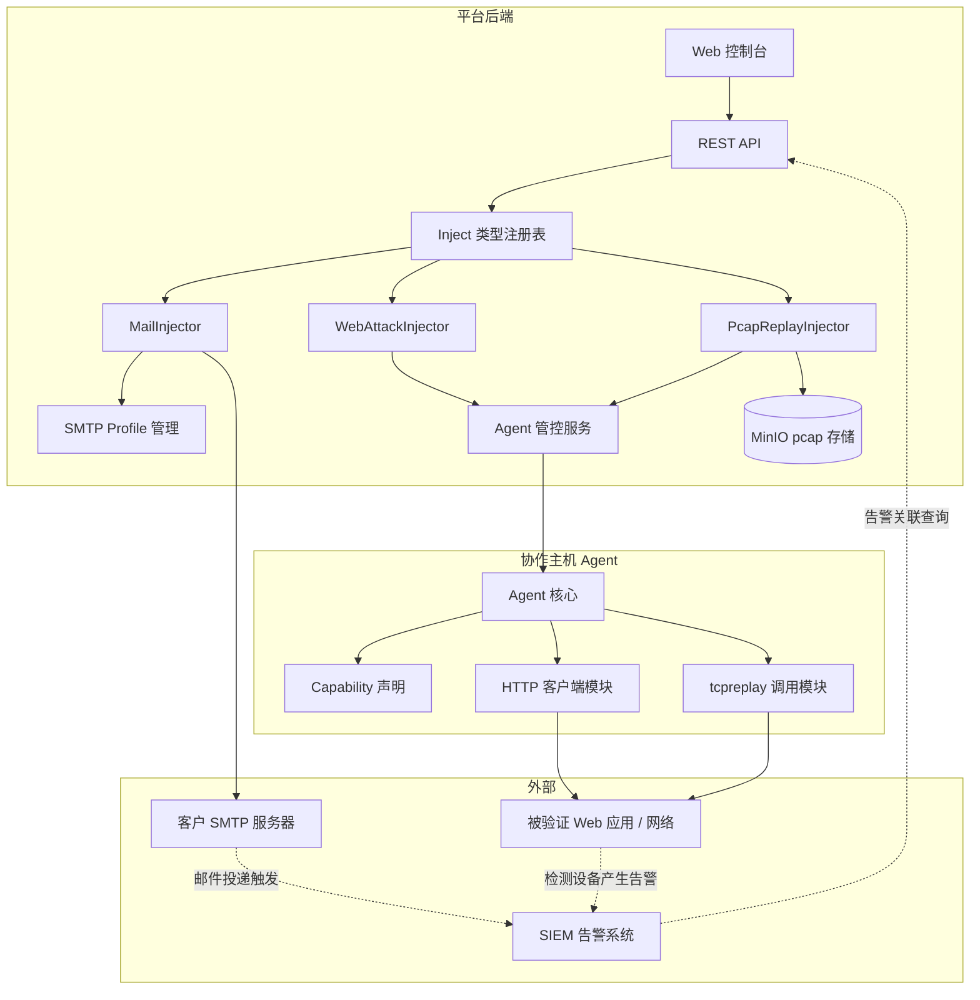
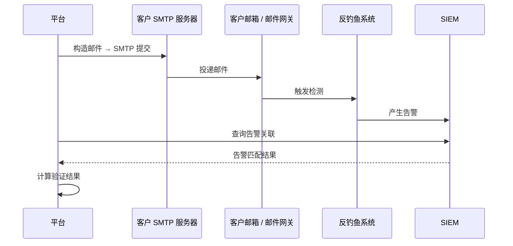
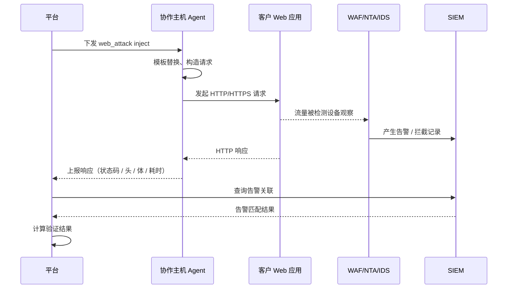
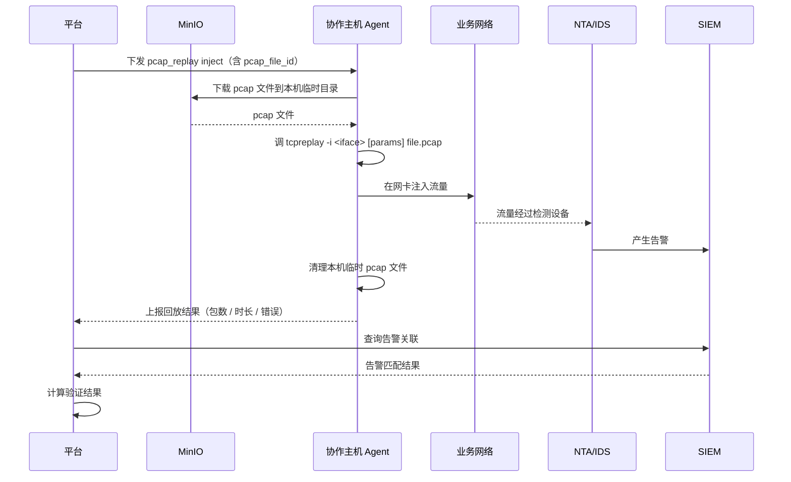
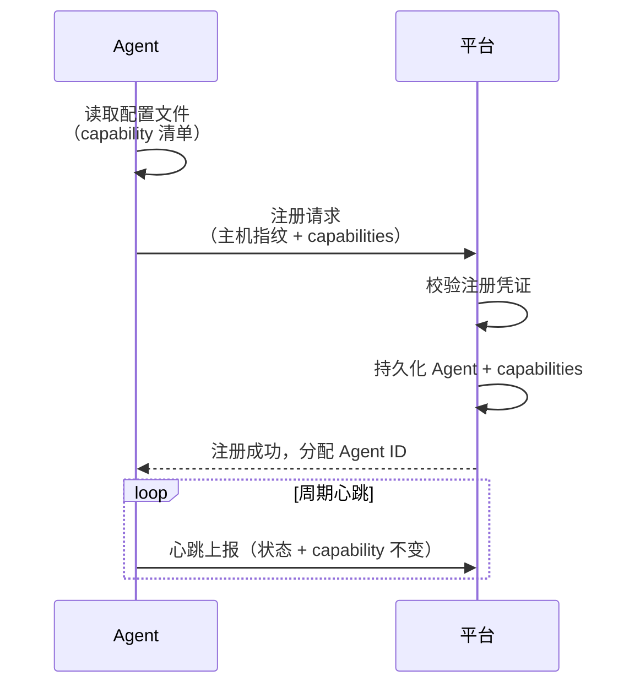
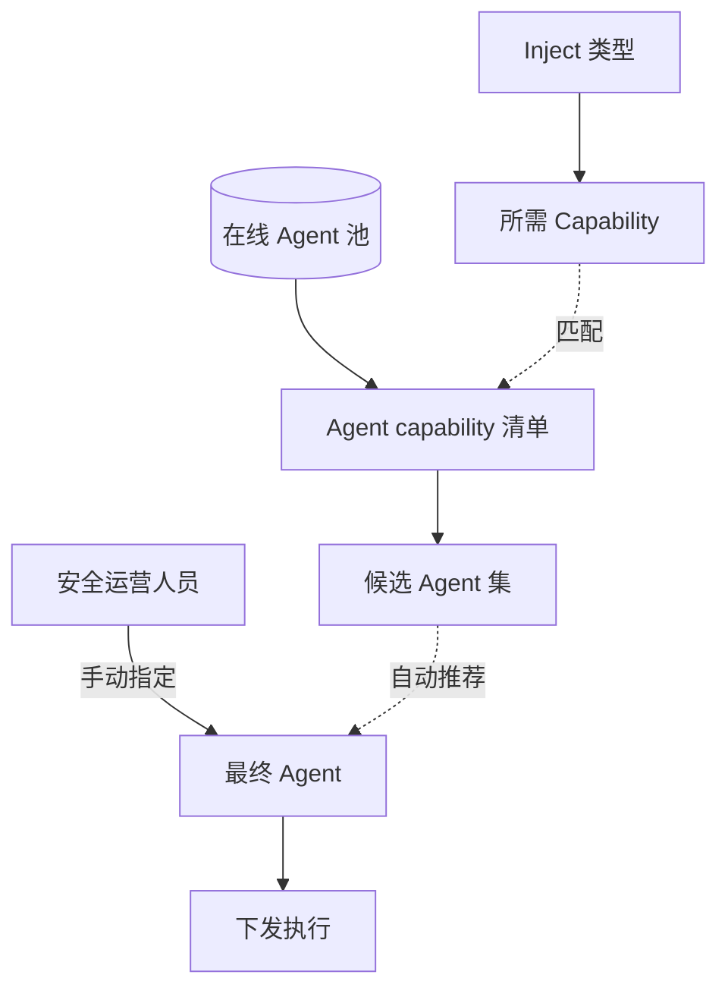

# Spec: B-ii 自定义 Inject 类型补全 + 协作主机 Agent

> 设计日期：2026-05-12
> PRD 来源：`docs/prd/产品要求.md` §2.3 第 3 行（6 种自定义用例类型）
> Workstream 拆解：B（§2.3 自定义验证）→ B-ii（3 种新 inject 类型补全：邮件 / web 攻击包 / pcap 回放）
> 状态：design approved，待 writing-plans 进入实施
> 相关已合 PR：Phase 0-12 + 12b-A/B/C/D + 12c-Bi/Biii（含 follow-up）+ enterprise-solution-document（main = `0d56cba15`）

---

## 1. 问题陈述

PRD §2.3 第 3 行要求 6 种自定义用例类型：

| 类型 | 当前状态 |
|---|---|
| 配置执行的命令 | ✅ 平台基础能力 |
| 上传可执行文件并配置执行命令 | ✅ 平台基础能力 |
| 上传样本文件 | ✅ 沙箱样本 inject（含 §2.5）|
| **构造 web 攻击包** | ❌ B-ii 待补 |
| **上传 pcap 流量包** | ❌ B-ii 待补 |
| **配置邮件形式** | ❌ B-ii 待补 |

B-ii 落地剩余 3 类 inject。设计中确立的关键架构原则：**网络位置即攻击源** —— 流量类与 web 类攻击必须从可控的网络位置发起，而不能由平台后端直连业务网络。这一原则同时驱动了**协作主机 Agent** 这个基础设施级演进。

---

## 2. 设计决策（已与用户协商）

| 决策点 | 选择 | 理由 |
|---|---|---|
| **范围** | 邮件 + Web 攻击包 + pcap 回放 三类全做 | 完整覆盖 PRD §2.3 第 3 行；不留半成品 |
| **邮件 inject 攻击源** | 平台后端直发 SMTP | 真实钓鱼场景就是"外部攻击者发 SMTP → 客户邮件网关"，平台后端扮演"外部攻击者"角色与真实场景一致 |
| **Web 攻击包 inject 攻击源** | 协作主机 Agent 发起 | 攻击源 IP 可控、流量路径可控、平台主机不需直连业务网络（隔离） |
| **pcap 回放 inject 攻击源** | 协作主机 Agent 调本机 tcpreplay | 复用现有 Agent 基础设施；零新增组件；与 §2.1 流量回放设备路径不冲突，未来作为 SPI 多实现 |
| **Agent 制品形态** | 一份代码、一套制品；通过 capability 声明承担不同角色 | 行业标准做法（SafeBreach Simulator / AttackIQ NTP / Cymulate Agent 等同模式）|
| **Agent 角色** | 两类：目标主机 Agent + 协作主机 Agent；同一份 Agent 通过 capability 切换 | 同上 |
| **PR 拆分** | 4 个独立 PR：PR-A capability 基础 + PR-B 邮件 + PR-C Web 攻击包 + PR-D pcap | PR-A 是 PR-B/C/D 共同依赖；后三者并行 |

---

## 3. 架构

### 3.1 Agent 角色拆分

| Agent 角色 | 部署位置 | 用途 | capability 示例 |
|---|---|---|---|
| **目标主机 Agent** | 客户被验证主机 | 主机内攻击行为（命令、文件、提权、痕迹等）| `command_exec` / `file_drop` |
| **协作主机 Agent** | 客户在网络合适位置部署的辅助 Linux 主机 | 从主机外向网络发起攻击 | `http_attack` / `pcap_replay` |

同一份制品 + capability 声明 → 同主机可声明多 capability 担多重角色。

### 3.2 Inject 与攻击源映射

| Inject 类型 | 攻击源 | 评估依据 |
|---|---|---|
| 邮件 | 平台后端 SMTP 客户端 | SIEM 关联告警（反钓鱼系统）|
| Web 攻击包 | 协作主机 Agent HTTP 客户端 | 响应特征 + SIEM 关联告警（WAF/NTA/IDS）|
| pcap 回放 | 协作主机 Agent tcpreplay | SIEM 关联告警（NTA/IDS）|

### 3.3 模块组件关系

---

## 4. 邮件 Inject 详细设计

### 4.1 用例契约扩展

新增 inject contract type：`mail`

| Contract 字段 | 含义 | 必填 |
|---|---|---|
| `mail_subject` | 邮件主题 | 是 |
| `mail_body_text` | 纯文本正文 | 二选一 |
| `mail_body_html` | HTML 富文本正文 | 二选一 |
| `mail_attachments` | 附件清单（关联 Documents）| 否 |
| `mail_inline_links` | 正文内嵌钓鱼 URL | 否 |
| `mail_from_alias` | 发件人显示名 | 否 |

### 4.2 SMTP Profile 实体

独立的 SMTP 配置管理，多 profile 切换：

| 字段 | 含义 |
|---|---|
| host / port | SMTP 服务器地址 |
| auth_type | 用户名密码 / OAuth2 / 无认证 |
| credentials | 加密存储凭据 |
| tls_mode | STARTTLS / TLS / 无 |
| default_from | 默认发件人 |

REST 端点：`/api/smtp_profiles` CRUD + 测试连通性按钮。

### 4.3 运行时参数

| 参数 | 含义 |
|---|---|
| `mail_to` | 收件人邮箱（多个）|
| `mail_cc` / `mail_bcc` | 可选抄送 |
| `smtp_profile_id` | 选用哪个 SMTP profile |
| 模板变量 | 主题 / 正文中可含 `{{username}}` / `{{company}}` 等占位 |

### 4.4 执行时序

### 4.5 期望评估

- **拦截维度**：邮件被反钓鱼系统拦在网关
- **检测维度**：反钓鱼系统产生告警（SIEM 关联告警匹配）

---

## 5. Web 攻击包 Inject 详细设计

### 5.1 用例契约扩展

新增 inject contract type：`web_attack`

| Contract 字段 | 含义 | 必填 |
|---|---|---|
| `web_request_method` | HTTP 方法 | 是 |
| `web_request_url` | 请求 URL | 是 |
| `web_request_headers` | HTTP Headers | 否 |
| `web_request_body` | 请求体 | 否 |
| `web_request_body_type` | 请求体格式（text/json/form/multipart）| body 存在时必填 |
| `web_request_cookies` | Cookies | 否 |
| `web_request_follow_redirects` | 跟随重定向 | 默认 false |
| `web_request_verify_tls` | TLS 证书校验 | 默认 false |
| `web_request_timeout_seconds` | 请求超时 | 默认 30 秒 |

### 5.2 单请求 vs 请求序列

| 模式 | 说明 |
|---|---|
| 单请求（默认）| 一个 contract = 一个 HTTP 请求 |
| 请求序列（高级）| JSON 数组形式存多个 request 步骤，每步可引用上一步响应（`{{step1.response.header.X-CSRF-Token}}` 等）|

### 5.3 运行时参数

| 参数 | 含义 |
|---|---|
| `target_host` / `target_port` | 目标主机 / 端口 |
| `agent_id` | 由哪台协作主机 Agent 发起 |
| 模板变量 | URL / Body / Header 中可含 `{{target_host}}` / `{{username}}` / `{{payload}}` 等占位 |

### 5.4 执行时序

### 5.5 期望评估

| 维度 | 评估方式 |
|---|---|
| 拦截维度 | 响应状态码 / 错误页特征 / 连接重置 / 超时 |
| 检测维度 | SIEM 关联告警匹配 |

响应特征自动判定：
- 状态码匹配（如 200 → 攻击未拦截）
- 响应正文包含特定字符串
- 重定向到错误页（拦截）
- 请求超时 / 连接重置（网络层拦截）

### 5.6 协作主机 Agent HTTP 客户端能力

- HTTP/1.1 + HTTP/2
- TLS（跳过校验 / 自定义 CA / 客户端证书）
- IPv6 双栈
- 代理（HTTP / SOCKS5）
- 自定义 DNS 解析
- Cookie jar（请求序列延续）
- 响应抓取上限（避免大响应阻塞）

### 5.7 安全约束

- 高危请求执行前可选二次确认
- Agent 端可设置目标白名单
- 全部请求记入审计日志

---

## 6. pcap 回放 Inject 详细设计

### 6.1 用例契约扩展

新增 inject contract type：`pcap_replay`

| Contract 字段 | 含义 |
|---|---|
| `pcap_file_id` | 关联的 pcap 文件（MinIO 存储）|
| `pcap_target_interface` | 协作主机回放使用的网卡名（如 eth0）|
| `pcap_replay_mode` | 回放速率模式 |
| `pcap_replay_rate` | 速率参数（按模式语义）|

### 6.2 回放速率模式

| 模式 | tcpreplay 参数 |
|---|---|
| 原始速率 | （无参数，按 pcap 时间戳）|
| 限速回放 | `--mbps=N` 或 `--pps=N` |
| 加速回放 | `--multiplier=N` |
| 最大速率 | `--topspeed` |

### 6.3 运行时参数

| 参数 | 含义 |
|---|---|
| `agent_id` | 由哪台协作主机 Agent 回放 |
| 接口名覆盖 | 运行时可覆盖 contract 默认接口 |
| 速率覆盖 | 运行时可覆盖 contract 默认速率 |

### 6.4 执行时序

### 6.5 期望评估

| 维度 | 评估方式 |
|---|---|
| 检测维度 | SIEM 关联告警匹配（NTA/IDS）|
| 拦截维度 | 取决于检测设备是否为旁路监听（旁路只看不拦），inline 模式可观察阻断 |

### 6.6 pcap 文件管理

- pcap 上传至 MinIO 桶 `veriguard-pcaps`
- 文件元数据：大小、抓包时长（首末包时间差）、包总数（pcap 头解析）
- 文件级权限：与用例契约权限联动
- 文件去重：基于 SHA-256 指纹

### 6.7 协作主机权限要求

Agent 调用 tcpreplay 需要 root 或 `CAP_NET_RAW + CAP_NET_ADMIN` 能力，运维部署时配置。

---

## 7. Agent Capability 机制详细设计

### 7.1 Capability 清单

平台预置 capability 标签清单：

| Capability | 含义 |
|---|---|
| `command_exec` | 能在主机执行命令 |
| `file_drop` | 能在主机写入文件 |
| `http_attack` | 能发起 HTTP 请求 |
| `pcap_replay` | 能本地回放 pcap |

后续按需扩展（如 `dns_query` / `icmp_send` / `smtp_send_local` 等）。

### 7.2 Agent 注册流程

### 7.3 Inject 与 Agent 匹配

### 7.4 Agent 通信通道扩展

| 指令 | 用途 | 由哪个 PR 实现 |
|---|---|---|
| `exec_http_request` | 下发 HTTP 请求规格 | PR-C |
| `exec_http_sequence` | 下发请求序列 | PR-C |
| `exec_pcap_replay` | 下发 pcap 回放任务 | PR-D |

### 7.5 通信安全

- TLS 加密通道
- Agent 注册时颁发独立凭据，可吊销
- 高危指令需平台侧 RBAC 审批

---

## 8. PR 拆分

| PR | 目标 | 工作量级 |
|---|---|---|
| **PR-A** | Agent Capability 机制（基础设施先行） | 中等 |
| **PR-B** | 邮件 Inject + SMTP Profile 管理 | 中等 |
| **PR-C** | Web 攻击包 Inject + Agent HTTP 能力 | 大 |
| **PR-D** | pcap 回放 Inject + Agent tcpreplay 能力 | 中等 |

依赖：PR-A → PR-B / PR-C / PR-D（PR-B/C/D 之间无依赖，可并行）。

每个 PR 的详细 plan 由 writing-plans skill 后续生成。

---

## 9. 测试策略

| 测试类型 | 覆盖范围 |
|---|---|
| 后端单测 | Inject 类型注册 / Capability 匹配 / MailInjector / WebAttackInjector / PcapReplayInjector / 模板变量替换 / 响应特征评估 |
| Agent 端单测 | HTTP 客户端 / tcpreplay 包装器 / pcap 文件下载 / 临时文件清理 |
| 集成测试 | 端到端 inject 执行（含 SIEM 告警关联查询）|
| 前端单测 | 各 inject 编辑器表单 / SMTP profile CRUD / pcap 文件管理 |
| 现有 baseline | 全套 vitest + Spring Boot test 0 回归 |

---

## 10. 风险点 & 缓解

| 风险 | 缓解 |
|---|---|
| 客户 SMTP 配置复杂（OAuth2 / 多域 / TLS 证书等）| SMTP profile 支持多种认证方式，连通性测试按钮 |
| 协作主机部署位置规划错误导致流量不经检测设备 | 实施前与客户共同规划部署位置（详见 §11）；运行画布上标注 Agent 位置 |
| 协作主机权限不足（无 CAP_NET_RAW 等）| Agent 启动时校验权限并提示，部署文档明确权限要求 |
| pcap 文件过大导致上传 / 下载超时 | MinIO 分块上传 + Agent 端断点续传，文件大小上限按客户需求配置 |
| HTTP 请求模板变量解析错误 | 严格的模板语法 + 运行时错误回报 + 编辑器实时校验 |
| 高危 inject 误触发（如 SQL 注入 payload 打到生产系统）| 目标白名单 + 二次确认机制 + 审计日志 |
| Agent capability 与平台不匹配（如 Agent 老版本不支持新 capability）| 注册时报告 Agent 版本号，平台拒绝过老版本 |

---

## 11. 客户配合事项

实施前需要客户预先准备的环境与配置：

### 11.1 邮件 Inject
- 1 份 SMTP 配置（hostname / port / 凭据 / TLS）
- 授权发件邮箱清单
- 授权收件邮箱清单
- 邮件网关 / 反钓鱼系统接入 SIEM

### 11.2 Web 攻击包 Inject
- 至少 1 台 Linux 协作主机（位置由客户根据验证场景规划）
- 目标白名单清单
- WAF / NTA / IDS 接入 SIEM
- 测试时间窗口

### 11.3 pcap 回放 Inject
- 同 11.2 协作主机要求
- Agent 主机 tcpreplay 权限（root 或 CAP_NET_RAW）
- 网络接口规划（哪个网卡）
- pcap 文件准备
- 流量回放合规评估与授权

### 11.4 协作主机部署位置规划

| 验证场景 | 推荐位置 |
|---|---|
| 南北向 NTA / IDS | 外网 / DMZ / 与生产网相对独立网段 |
| 东西向 IDS / 内部检测 | 内网核心 / 业务系统 VLAN |
| WAF | WAF 之外、能访问被保护应用 |
| 邮件钓鱼链接 web 应用 | 外网或 DMZ（模拟员工点击来源）|
| 多网段检测覆盖 | 多台协作主机覆盖多网段 |

---

## 12. 范围 Boundary（YAGNI — 本 spec 不做）

### 12.1 邮件 Inject
- ❌ 邮件接收验证（IMAP / Exchange API）
- ❌ 邮件追踪像素 / 阅读回执
- ❌ 附件杀软 sandbox 联动
- ❌ 多 SMTP 负载均衡 / 失败回退

### 12.2 Web 攻击包 Inject
- ❌ 请求序列高级特性（条件分支、循环、断言）
- ❌ Fuzzing / 模糊测试模式
- ❌ WebSocket / gRPC 协议
- ❌ JS 渲染 / Headless 浏览器
- ❌ 请求录制回放（HAR 导入）
- ❌ MITM 代理模式

### 12.3 pcap 回放 Inject
- ❌ pcap 编辑 / 改写（IP / 端口 / MAC）
- ❌ 多 pcap 文件批量回放
- ❌ pcap 内容索引 / 检索
- ❌ 专用流量回放设备适配（§2.1 路径）
- ❌ pcap 实时录制

### 12.4 Capability 机制
- ❌ Capability 自动发现
- ❌ Capability 版本化
- ❌ Capability 依赖关系图
- ❌ 运行时动态启用 / 禁用
- ❌ 客户自定义 capability

### 12.5 整体
- ❌ 跨 inject 类型的数据流（用攻击编排链路 + 模板变量表达）
- ❌ Inject 模板市场（社区共享）
- ❌ PRD §2.3 第 3 行未列的其他 inject 类型（DNS query / ICMP ping flood 等）

---

## 13. 完成标准

- ✅ PRD §2.3 第 3 行 6 类用例完整覆盖
- ✅ Agent 制品支持多 capability 声明，目标主机 Agent 与协作主机 Agent 共用同一份代码
- ✅ 邮件 / Web 攻击包 / pcap 三类 inject 端到端可跑通
- ✅ 测试全过 + 0 回归
- ✅ origin/master 仍锁 `5d7e05da6`，全部 PR base=main

---

## 14. 后续相关 sub-project

- **§2.5 沙箱 M2/M3**：CAPEv2 接入 + 样本上传 inject + 报告回采
- **§2.1 流量回放设备**：作为 pcap inject 的另一种实现路径（SPI 多实现），与本期 Agent 回放并存
- **§2.2 主机 HIDS 集成深化**：补充主机 Agent 用例库与多厂商 HIDS Agent 适配
